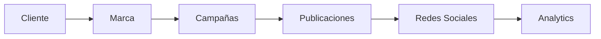
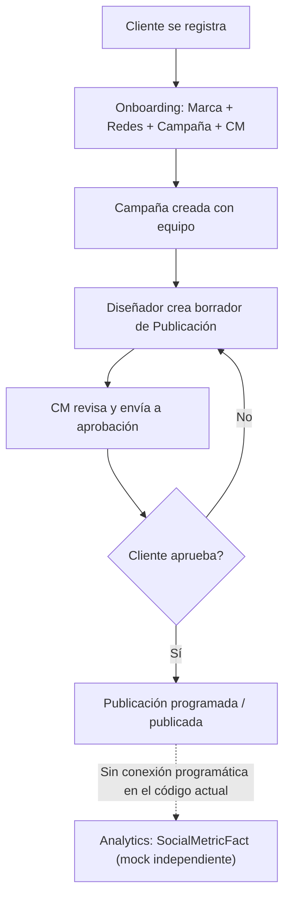
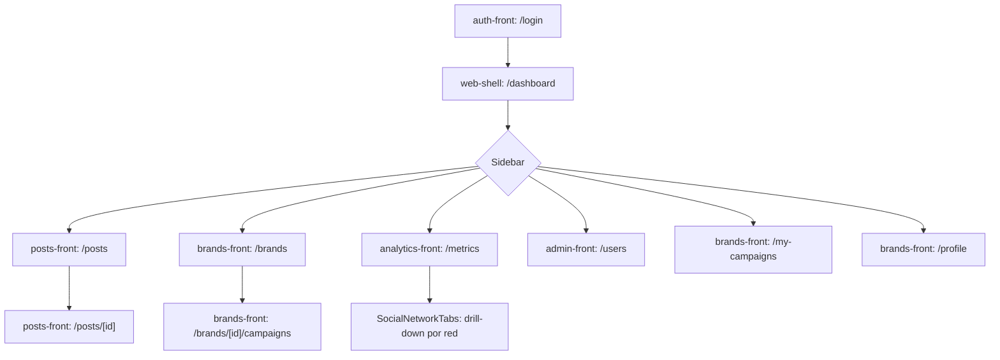
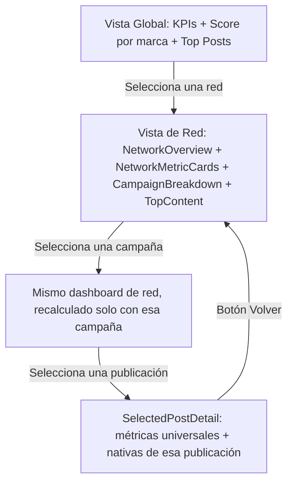
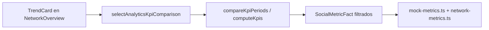
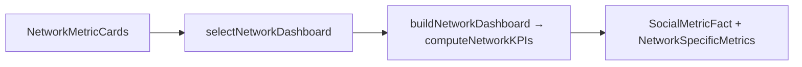
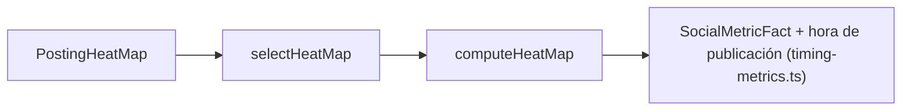
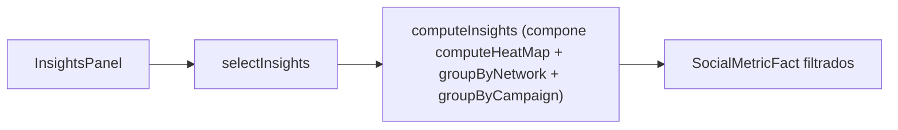

# Documentación funcional y técnica del frontend — Bananagram

> Generado a partir de lectura directa del código fuente (sin suposiciones) tras completar las Fases 1–4 del rediseño del módulo de Analytics. Refleja el estado real del sistema, incluyendo comportamientos incompletos, mocks no conectados y hallazgos de inconsistencia. Documento vivo — no representa el backend, que aún no existe.

---

## 1. Vista general del sistema

Bananagram es una plataforma SaaS de **gestión de redes sociales y puntuación digital**, orientada a marcas y personas que necesitan gestionar su presencia digital de forma organizada, medible y con flujos de aprobación de contenido. Su propósito central (según el documento funcional de origen del proyecto) es permitir que un equipo formado por un **Community Manager** y uno o más **Diseñadores** trabaje coordinadamente bajo la supervisión de un **Cliente**, produciendo publicaciones aprobadas, organizadas en campañas, con métricas de rendimiento y una puntuación digital ("Score Digital") que refleje la salud de la presencia en redes. Un cuarto rol, el **Administrador**, opera a nivel de sistema (usuarios, catálogos, auditoría) sin pertenecer a ninguna marca.

### 1.1 Cómo interactúan los cuatro roles

- **Cliente**: dueño de la marca. Se auto-registra, crea su marca, elige las redes sociales que quiere gestionar, selecciona un Community Manager y aprueba o rechaza el contenido antes de que se publique.
- **Community Manager (CM)**: líder operativo de una campaña. Es seleccionado por el Cliente, arma su equipo de Diseñadores, crea/programa/publica contenido y coordina el flujo de aprobación.
- **Diseñador**: colaborador creativo. Es incorporado por el CM a una campaña, crea borradores de publicaciones (copy + contenido visual) que el CM revisa antes de enviarlos a aprobación del Cliente.
- **Administrador**: no participa en el flujo de contenido. Configura el sistema: registra usuarios operativos (CM/Diseñador), mantiene los catálogos (redes sociales, categorías, especialidades) y accede al log de auditoría completo.

Estos cuatro roles giran alrededor de un mismo eje de datos: una Marca agrupa Campañas, las Campañas agrupan Publicaciones, las Publicaciones ocurren en Redes Sociales concretas, y el rendimiento de todo ese contenido se consulta en Analytics.



Este diagrama es el hilo conductor de todo el documento: los Capítulos 3–4 documentan la arquitectura y los roles que operan sobre este eje; el Capítulo 7 documenta cada pantalla; los Capítulos 8–10 documentan en profundidad el extremo derecho del diagrama (Analytics), que es donde se concentró el trabajo de las Fases 1–4.

---

## 2. Flujo principal del negocio

Este capítulo responde, con base estricta en el código, cómo recorre el sistema una marca desde que nace hasta que su desempeño se analiza.

### 2.1 ¿Cómo nace una marca?

Una marca nace exclusivamente a través del **Onboarding Wizard** de `brands-front` (`/onboarding`), un `Stepper` de 5 pasos: **Crear marca → Redes sociales → Campaña → Community Manager → Confirmación** (detallado técnicamente en el Capítulo 4 §4.4 y en la tabla de pantallas del Capítulo 7). El Cliente llega aquí después de `/register` en `auth-front` (o, en el flujo real de negocio, después de crear una campaña adicional desde una marca ya existente).

Al finalizar el wizard (`handleFinish()`), en un solo evento del lado del cliente (sin backend) se crean, todos en memoria vía `mock-data.ts` de `brands-front`:
1. La marca (`MOCK_BRANDS.push(...)`), con un score inicial en cero y clasificación `'bajo'`.
2. Un `BrandProfile` por cada red social elegida (`MOCK_BRAND_PROFILES.push(...)`).
3. La primera campaña de esa marca (`MOCK_CAMPAIGNS.push(...)`) — el campo "objetivo de la campaña" capturado en el formulario **se descarta**, solo se usa para mostrarlo en la pantalla de confirmación.
4. El equipo de esa campaña, con el Community Manager elegido (`assignTeamToCampaign(...)`) — los Diseñadores **no** se asignan en este paso; eso ocurre después, desde la pantalla de Equipo de la campaña.

### 2.2 ¿Cómo se crea una campaña (adicional)?

Fuera del onboarding, una marca ya existente crea nuevas campañas desde `/brands/[id]/campaigns` vía `CreateCampaignDialog`. A diferencia del onboarding, aquí el flujo sí sugiere Diseñadores automáticamente: al elegir un CM, `designerIds` se pre-marca con **todos** los Diseñadores de ese CM, y el Cliente actual se agrega al equipo con rol `'Cliente'` — es decir, el equipo completo (CM + Diseñadores + Cliente) queda armado en un solo paso, a diferencia del onboarding donde solo queda el CM.

### 2.3 ¿Cómo participan Cliente, Community Manager y Diseñador?

| Rol | Su parte en el ciclo de una publicación |
|---|---|
| Diseñador | Crea el borrador (contenido + copy) en `/posts/new` |
| Community Manager | Revisa el borrador, lo envía a aprobación del Cliente, y —una vez aprobado— lo programa/publica |
| Cliente | Aprueba o rechaza la publicación antes de que salga al aire; si rechaza, debe (por diseño de negocio) volver al Diseñador con un motivo |

**Limitación detectada**: en el código actual, este ciclo existe como **flujo visual** (botones "Enviar a revisión", "Aprobar", "Rechazar", "Programar" existen y están correctamente gateados por permiso), pero **ninguno de esos botones tiene lógica real de transición de estado** — `MOCK_POSTS` nunca se muta. Ver el detalle exacto en el Capítulo 7 §7.4 y la lista de pendientes en el Capítulo 17 §17.3.

### 2.4 ¿Cómo llega una publicación hasta Analytics?

Esta es la pregunta más importante de responder con honestidad, porque **no hay una tubería real entre `posts-front` y `analytics-front` en el código actual**. Cada microfrontend mantiene su propio `mock-data.ts` de forma completamente independiente (documentado en el Capítulo 1 §1.1): `analytics-front` no importa, escucha ni consume nada de `posts-front`. Su propio dataset (`mock-metrics.ts` + `network-metrics.ts`, ver Capítulo 14) fue construido a mano para *narrar* el mismo universo de marcas/campañas/redes (los nombres de marca y campaña coinciden deliberadamente: "Zara MX", "Campaña Verano", etc.), y algunos ids de publicación incluso coinciden (`p1`, `p2`, `p5`, `p9`, `p11`) — pero eso es coincidencia de diseño narrativo, no una relación programática. En una implementación con backend real, este es exactamente el punto donde debería existir el pipeline de ingestión de métricas (publicación → evento de publicado → simulador/API de red social → `post_metrics`), tal como se documenta como pendiente en el Capítulo 17.



---

## 3. Arquitectura general

### 3.1 Monorepo

pnpm workspace + Turborepo. Cada microfrontend es una app Next.js 16 (App Router) independiente, con su propio `store` de Redux, su propio `providers.tsx` y su propia copia de mocks — **no existe un backend real ni un servicio de datos compartido**. La única pieza compartida en tiempo de ejecución es el paquete `@repo/ui` (`apps/frontend/commons`), consumido como fuente TypeScript directa (`main: ./src/index.ts`, sin paso de build propio).

| Microfrontend | Puerto | Responsabilidad |
|---|---|---|
| `auth-front` | 3012 | Login, registro, activación de cuenta, recuperación de contraseña |
| `web-shell` | 3000 | Punto de entrada (`/`), dashboard por rol (`/dashboard`) |
| `brands-front` | 3013 | Marcas, campañas, calendario, equipo, onboarding, perfil, score, reportes |
| `analytics-front` | 3011 | Centro de Inteligencia de Redes Sociales (Fases 1–4) |
| `posts-front` | 3014 | Publicaciones, aprobaciones, composición de contenido |
| `admin-front` | 3010 | Usuarios, roles/privilegios, catálogos, auditoría |
| `commons` (`@repo/ui`) | — | Design system, hooks de sesión/permisos, tipos, mocks de auth |

### 3.2 Sesión compartida entre microfrontends

- Cookie `bananagram_token` (`path=/; SameSite=Lax`, sin dominio explícito) — funciona entre puertos de `localhost` porque las cookies son por **host**, no por puerto.
- `useSessionBootstrap()` (`@repo/ui`) es el único inicializador de sesión: al montar, lee la cookie y despacha `setCredentials` o `logout` sobre el slice `auth` de Redux. Se invoca idénticamente en los 6 `providers.tsx`.
- El token es un JWT **simulado** (`base64(header).base64(payload).mock-signature`, sin firma real) que codifica `{sub, email, role, brandIds, permissions}`.
- Navegación entre microfrontends: enlaces `http://localhost:PORT/...` con `window.location.href` (recarga completa; la cookie viaja automáticamente). Navegación dentro de un mismo microfrontend: `router.push` (SPA).
- **Mecanismo obsoleto**: `?mock_user=` en la URL y `useMockSessionFromUrl()` fueron eliminados el 2026-06-30 a favor de la cookie; los símbolos siguen exportados como no-ops para no romper imports antiguos.

### 3.3 Autenticación y permisos — estado real

- No hay backend: `authApi` (RTK Query, `@repo/ui`) define `login`/`register` contra `POST auth/login` y `POST auth/register`, pero **ningún formulario los usa** — todos los formularios de `auth-front` resuelven contra `MOCK_USERS` en memoria.
- RBAC dinámico simulado: `usePermissions().can(module, action)` verifica `permissions[module]?.includes(action)` sobre el payload decodificado del JWT falso — el mismo mecanismo que en producción leería `GET /me/permissions`.
- Gating real de UI hoy: mezcla inconsistente de `ProtectedAction` (oculta elementos), chequeos inline `can()/canAny()` (oculta secciones), y en un solo caso (`admin-front /roles`) un guard de página completo. La mayoría de rutas **no tienen guard de página** — son alcanzables por URL directa independientemente del permiso; solo el contenido interno se oculta condicionalmente.
- `middleware.ts` de `web-shell` es un passthrough total hoy (comentario explícito: *"el login real todavía no setea la cookie access_token... restaurar cuando el login quede conectado al backend"*).

### 3.4 Stack por app

Next.js 16 (App Router) + React 19 + MUI 5 + Redux Toolkit 2 + `@repo/ui`. `analytics-front` usa además Recharts 2. `web-shell` usa además `@mui/x-data-grid`, `react-big-calendar`, Tailwind. `brands-front` usa `react-big-calendar` + `date-fns` para el calendario.

---

## 4. Roles

El sistema reconoce 4 roles (`AppRole`): `administrador`, `community_manager`, `disenador`, `cliente`. No hay un 5º rol "invitado" — todo lo no autenticado redirige a `/login`.

### 4.1 Administrador (Laura Méndez — `admin@bananagram.mx`)

**Permisos** (`MOCK_USERS`): `users:manage`, `brands:manage`, `catalogs:manage`, `post:[create,schedule,approve,reject,publish]`, `campaigns:manage`, `metrics:view`, `score:view`, `reports:export`.

**Dashboard** (`web-shell` → `DashboardAdmin`): KPIs de usuarios activos/pendientes de activación, catálogos configurados, roles del sistema; panel "Usuarios por rol"; accesos rápidos a Usuarios/Roles/Categorías/Auditoría; actividad reciente (audit log).

**Módulos disponibles** (Sidebar, evaluado string-a-string contra sus permisos): Dashboard, Posts (`post:create`), Marcas (`brands:manage`), Métricas (`metrics:view`), Admin (`users:manage`), Mi perfil (`post:create`). **No ve "Mis Campañas" ni "Mi marca" ni "Team"** — tiene `campaigns:manage`, no `campaigns:view-own`/`campaigns:create` (comparación de string exacta, no jerárquica).

**Qué puede hacer**: crear usuarios operativos (CM/Diseñador) vía `CreateUserDialog` (genera un link de activación mock); editar (visualmente, sin lógica real) la matriz de privilegios en `/roles`; gestionar catálogos (categorías/redes/especialidades) vía `CatalogList`; consultar auditoría (solo lectura); todas las acciones de publicación (crear/programar/aprobar/rechazar/publicar); ver métricas/score; exportar reportes.

**Limitación real detectada**: casi todas las acciones "administrativas" (editar usuario, guardar privilegios, alternar catálogo activo) son mocks sin persistencia — solo el alta de usuario y de ítems de catálogo modifican el estado local de React.

### 4.2 Cliente (Roberto Fernández — `cliente@bananagram.mx`)

**Permisos**: `post:[approve,reject]`, `campaigns:create`, `metrics:view`, `score:view`, `reports:export`.

**Dashboard** (`DashboardCliente`): nombre de marca, pendientes de aprobación, campañas activas, alcance/engagement 24h, `ScoreGauge`, lista "Esperan tu aprobación" (estado vacío: "No hay publicaciones pendientes. 🎉"), equipo de campaña.

**Módulos disponibles**: Dashboard, Posts (tiene `post:approve`), Mi marca (`campaigns:create`), Métricas, Admin **no**, Mi perfil **no** (no tiene `post:create` ni `campaigns:view-own`).

**Qué puede hacer**: aprobar/rechazar publicaciones (botones visibles, **sin `onClick` funcional** — ver §17.3); iniciar el onboarding de una nueva marca/campaña (único rol con `campaigns:create`); seleccionar un Community Manager al crear campaña; ver métricas y score; exportar reportes (mock, genera un Blob en el navegador).

**Particularidad de negocio**: es el único rol que se auto-registra (`/register` en `auth-front`, aunque en el mock siempre reutiliza la cuenta demo de Cliente).

### 4.3 Community Manager (Ana García — `cm@bananagram.mx`)

**Permisos**: `post:[create,schedule,publish]`, `campaigns:view-own`, `metrics:view`, `score:view`.

**Dashboard** (`DashboardCM`, también el **fallback por defecto** de `/dashboard` si el rol no matchea ninguno de los otros 3): saludo, KPIs (pendientes de revisión, campañas activas, score promedio, próxima publicación), progreso de campañas, publicaciones recientes, gráficas de posts por estado y por red.

**Módulos disponibles**: Dashboard, Posts, Mis Campañas, Métricas, Team, Mi perfil. **No** ve Marcas ni Admin.

**Qué puede hacer**: crear/programar/publicar publicaciones; ver (no gestionar) sus campañas asignadas; agregar/quitar Diseñadores de una campaña (`ProtectedAction module="post" action="schedule"`); ver métricas/score. **No** puede aprobar ni rechazar (esas acciones son exclusivas de Cliente/Admin).

### 4.4 Diseñador (Carlos Ruiz — `disenador@bananagram.mx`)

**Permisos**: `post:create`, `campaigns:view-own`. El rol con menos privilegios del sistema.

**Dashboard** (`DashboardDisenador`): saludo, KPIs de borradores/rechazadas/publicadas, "Mis campañas" (estado vacío vía `EmptyState`: "Sin campañas" / "El CM te asignará cuando haya trabajo disponible"), publicaciones recientes (estado vacío: "Aún no tienes publicaciones" / "Crea tu primer borrador").

**Módulos disponibles**: Dashboard, Posts, Mis Campañas, Team, Mi perfil. **No** ve Métricas (no tiene `metrics:view`) ni Marcas ni Admin.

**Qué puede hacer**: crear borradores de publicaciones; ver las campañas donde participa. No puede programar, publicar, aprobar ni rechazar.

### 4.5 Nota transversal

Los 4 roles comparten exactamente los mismos componentes de pantalla — no hay vistas separadas por rol dentro de una misma ruta (excepto el switch de dashboards en `web-shell`); la diferenciación es 100% por ocultamiento condicional de botones/secciones vía `usePermissions()`.

---

## 5. Qué ve cada rol — panorama funcional

El Capítulo 4 documenta los permisos técnicos exactos. Este capítulo lo complementa desde la perspectiva de un usuario que inicia sesión por primera vez, sin hablar de módulos/acciones en abstracto sino del recorrido real en pantalla.

### 5.1 Administrador

**Al iniciar sesión** aterriza en `web-shell:3000/dashboard`, que le muestra `DashboardAdmin`: un panorama de salud del sistema (usuarios activos, pendientes de activar, catálogos configurados) más un acceso directo a los 4 módulos administrativos y la actividad reciente del log de auditoría.

**En el Sidebar ve**: Dashboard, Posts, Marcas, Métricas, Admin, Mi perfil.

**Sí puede**: dar de alta cuentas de Community Manager/Diseñador y generarles un link de activación; navegar la matriz de privilegios por rol; agregar categorías/redes/especialidades al catálogo global; consultar (nunca editar) la bitácora de auditoría; ejecutar cualquier acción sobre publicaciones (crear, programar, aprobar, rechazar, publicar); consultar métricas y score de cualquier marca.

**No puede**: eliminar usuarios, roles ni ítems de catálogo (esa acción no existe en ninguna pantalla del sistema); gestionar campañas propias (no tiene `campaigns:view-own`, así que no ve "Mis Campañas" aunque técnicamente sí puede publicar); confiar en que "Guardar cambios" en `/roles` persista algo — es un mock puramente visual.

**Flujo típico**: entra a `/users` a incorporar un nuevo Community Manager → revisa `/roles` para confirmar qué puede hacer ese rol → visita `/audit-log` para revisar actividad reciente → eventualmente entra a `/metrics` a supervisar el desempeño general.

### 5.2 Cliente

**Al iniciar sesión** ve `DashboardCliente`: el nombre de su marca, cuántas publicaciones esperan su aprobación, sus campañas activas, un resumen de alcance/engagement de las últimas 24h y su `ScoreGauge`.

**En el Sidebar ve**: Dashboard, Posts, Mi marca, Métricas. (No ve Marcas, Mis Campañas, Team, Mi perfil ni Admin.)

**Sí puede**: crear una marca nueva y su primera campaña a través del Onboarding Wizard; elegir con qué Community Manager trabajar; ver el detalle de cualquier publicación pendiente de su aprobación; consultar Analytics completo (los 6 tabs, drill-down de 4 niveles); exportar reportes mock en CSV/PDF.

**No puede**: los botones "Aprobar"/"Rechazar" están visibles pero **no ejecutan ninguna transición real** — es la limitación más relevante de su experiencia hoy, documentada también en el Capítulo 7; tampoco puede editar directamente el equipo de una campaña (eso es exclusivo del CM) ni gestionar catálogos.

**Flujo típico**: primera vez → `/register` → Onboarding (marca, redes, campaña, CM) → `/dashboard` para supervisar; visitas recurrentes → revisa aprobaciones pendientes → entra a `/metrics` a evaluar el desempeño de sus redes por campaña o publicación → exporta un reporte.

### 5.3 Community Manager

**Al iniciar sesión** ve `DashboardCM` (que además es la vista por defecto si el sistema no reconoce el rol): saludo personalizado, pendientes de revisión, campañas activas, score promedio, próxima publicación programada, progreso visual de cada campaña y gráficas de posts por estado/red.

**En el Sidebar ve**: Dashboard, Posts, Mis Campañas, Métricas, Team, Mi perfil.

**Sí puede**: crear, programar y publicar contenido; incorporar o quitar Diseñadores de una campaña que lidera; consultar métricas y score de las marcas donde participa; completar su propio perfil de categorías/especialidades para aparecer en el matching de Clientes.

**No puede**: aprobar ni rechazar publicaciones (esa decisión es exclusiva del Cliente o del Admin); gestionar marcas ni catálogos; ver el módulo Admin.

**Flujo típico**: revisa borradores de sus Diseñadores en `/posts/approvals` → los envía a aprobación del Cliente → una vez aprobados, los programa → gestiona el equipo de la campaña en `/brands/{id}/campaigns/{id}/team` → consulta `/metrics` para ver qué está funcionando.

### 5.4 Diseñador

**Al iniciar sesión** ve `DashboardDisenador`: saludo, conteo de borradores/rechazadas/publicadas, sus campañas asignadas (con estado vacío explícito si aún no tiene ninguna) y sus publicaciones recientes.

**En el Sidebar ve**: Dashboard, Posts, Mis Campañas, Team, Mi perfil. **No ve Métricas** — es el único rol operativo sin acceso a Analytics.

**Sí puede**: crear borradores de publicaciones (contenido + copy) en `/posts/new`; ver (sin gestionar) las campañas donde el CM lo incorporó; completar su perfil de categorías/especialidades.

**No puede**: programar, publicar, aprobar ni rechazar nada; ver métricas ni score; gestionar el equipo de una campaña.

**Flujo típico**: es incorporado a una campaña por el CM → completa su perfil para ser encontrable → crea borradores en `/posts/new` → espera la revisión del CM → repite.

---

## 6. Flujo completo de navegación

### 6.1 Mapa visual de navegación



Cada nodo de segundo nivel (`Posts`, `Marcas`, `Analytics`, `Admin`, `Mis Campañas`, `Mi perfil`) vive en un **microfrontend distinto** al de `Dashboard` — la navegación entre ellos es siempre una recarga completa de página (`window.location.href`), no un `router.push` de SPA; la cookie de sesión viaja automáticamente en esa recarga. El Capítulo 3 §3.2 (Sesión compartida) documenta el mecanismo técnico exacto.

### 6.2 Mapa global (enlaces reales entre apps)

```
auth-front:3012
  /login ──(éxito)──► web-shell:3000/dashboard
  /register ──(éxito)──► brands-front:3013/onboarding
  /activate?email=... ──(éxito)──► web-shell:3000/dashboard
  /forgot-password ──► /reset-password (no conectados entre sí por token real)

web-shell:3000
  / ──► auth-front:3012/login (redirect incondicional)
  /dashboard (único destino real; todo lo demás en el Sidebar apunta a otro puerto)
    ├─► posts-front:3014/posts
    ├─► brands-front:3013/{brands|my-campaigns|my-brand|team|profile}
    ├─► analytics-front:3011/metrics
    └─► admin-front:3010/users
  (logout, desde cualquier TopBar) ──► auth-front:3012/login
```

### 6.3 Sidebar — ítems y permisos (idéntico en brands-front, posts-front, admin-front; ligera variante en web-shell)

| Ítem | Destino | Permiso requerido |
|---|---|---|
| Dashboard | `web-shell:3000/dashboard` | ninguno |
| Posts | `posts-front:3014/posts` | `post:create` OR `post:approve` |
| Marcas | `brands-front:3013/brands` | `brands:manage` |
| Mis Campañas | `brands-front:3013/my-campaigns` | `campaigns:view-own` |
| Mi marca | `brands-front:3013/my-brand` | `campaigns:create` |
| Métricas | `analytics-front:3011/metrics` | `metrics:view` |
| Team | `brands-front:3013/team` | `campaigns:view-own` |
| Mi perfil | `brands-front:3013/profile` | `post:create` OR `campaigns:view-own` |
| Admin | `admin-front:3010/users` | `users:manage` |

### 6.4 Navegación interna — brands-front

```
/brands ──► /brands/[id] ──► BrandTabs: Resumen · Campañas · Calendario · Métricas · Score · Reportes
/brands/[id]/campaigns ──► /brands/[id]/campaigns/[campaignId] ──► CampaignTabs: Resumen · Publicaciones · Equipo
/onboarding (wizard de 5 pasos) ──► al finalizar, recarga completa a /brands/{nuevaMarca}
/my-campaigns ──► /brands/[brandId]/campaigns/[campaignId]
/my-brand ──► redirect server-side a /brands/{MOCK_BRANDS[0].id} (siempre la primera marca, no resuelve el usuario real)
```

### 6.5 Navegación interna — posts-front

```
/posts ──► /posts/[id]
/posts/new ──► (guardar/enviar) ──► /posts o /posts/approvals (solo navegación, no persiste el post)
/posts/approvals (3 secciones: Borradores · Esperando cliente · Rechazados)
```
⚠️ Enlaces rotos detectados: `/posts/[id]` enlaza a `/brands/campaigns/{id}` (falta el segmento `[brandId]` que exige la ruta real de brands-front) y a un campaign id hardcodeado `c2`.

### 6.6 Navegación interna — analytics-front (ver Capítulo 8 para el detalle)

```
/metrics
  Tabs: Resumen · Comparativas · Tendencias · Insights & Score · Audiencia · Actividad
  (dentro de Resumen) SocialNetworkTabs: Marca(scope) → Red → Campaña → Publicación, todo inline sin cambiar de ruta
```

### 6.7 Navegación interna — admin-front

```
/users ──► CreateUserDialog (modal, no navega)
/roles (guard de página: solo users:manage)
/catalogs/{categories|social-networks|specialties} ──► AdminTabs
/audit-log
```
Todas comparten `AdminTabs`; no hay drill-down entre ellas.

---

## 7. Pantallas (inventario completo)

Leyenda de permisos: `—` = sin gate explícito en la pantalla (solo gateada por visibilidad del ítem de Sidebar, si aplica).

### 7.1 auth-front

| Pantalla | Ruta | Objetivo | Acciones | Permisos | Datos | Navega a |
|---|---|---|---|---|---|---|
| Login | `/login` | Autenticar contra `MOCK_USERS` | Submit, "Crea tu cuenta", "¿Olvidaste tu contraseña?" | — | `MOCK_USERS` (`@repo/ui`) | `web-shell/dashboard`, `/register`, `/forgot-password` |
| Registro | `/register` | Auto-registro de Cliente (mock: siempre reutiliza la cuenta demo) | Submit | — | `MOCK_CLIENT_EMAIL` fijo | `brands-front/onboarding` |
| Activación | `/activate?email=` | CM/Diseñador crean su primera contraseña | Submit | — | `findUserByEmail` | `web-shell/dashboard` |
| Recuperar contraseña | `/forgot-password` | Solicitar reseteo (sin backend) | Submit (no-op real) | — | — | `/login` |
| Restablecer contraseña | `/reset-password` | Definir nueva contraseña (sin backend, sin token) | Submit (no-op real) | — | — | auto-redirect `/login` (1.2s) |

### 7.2 web-shell

| Pantalla | Ruta | Rol(es) | KPIs/Gráficas | Estados vacíos | Origen de datos |
|---|---|---|---|---|---|
| Dashboard Admin | `/dashboard` (rol admin) | Administrador | 4 KPI cards, panel usuarios por rol, actividad reciente | ninguno | `MOCK_ADMIN_DASHBOARD` |
| Dashboard CM | `/dashboard` (rol CM, también fallback) | Community Manager | 4 KPIs, `LinearProgress` por campaña, `BarChart` posts por estado, `PieChart` posts por red | ninguno | `MOCK_DASHBOARD`, `MOCK_POSTS_BY_STATUS/NETWORK` |
| Dashboard Cliente | `/dashboard` (rol Cliente) | Cliente | 4 KPIs, `ScoreGauge`, lista de aprobaciones pendientes | "No hay publicaciones pendientes. 🎉" | `MOCK_CLIENTE_DASHBOARD` |
| Dashboard Diseñador | `/dashboard` (rol Diseñador) | Diseñador | 3 KPIs | "Sin campañas" / "Aún no tienes publicaciones" (`EmptyState`) | `MOCK_DISENADOR_DASHBOARD` |

### 7.3 brands-front (11 rutas)

| Pantalla | Ruta | Objetivo | Componentes reutilizados | Origen de datos |
|---|---|---|---|---|
| Listado de marcas | `/brands` | Selector de marca | — (MUI puro) | `MOCK_BRANDS` |
| Resumen de marca | `/brands/[id]` | Score + campañas de la marca | `ScoreGauge`, `BrandTabs` | `MOCK_BRANDS`, `MOCK_CAMPAIGNS` |
| Calendario | `/brands/[id]/calendar` | Vista de contenido programado (solo lectura, sin drag&drop) | `react-big-calendar` | `MOCK_CALENDAR_EVENTS` |
| Campañas | `/brands/[id]/campaigns` | Listar/crear campañas | `CreateCampaignDialog` | `MOCK_CAMPAIGNS` (local state) |
| Resumen de campaña | `/brands/[id]/campaigns/[campaignId]` | Progreso de publicación | `CampaignTabs` | `MOCK_POSTS_BY_CAMPAIGN` |
| Publicaciones de campaña | `.../posts` | Tabla de posts de la campaña | `DataTable`, `StatusChip` | `MOCK_POSTS_BY_CAMPAIGN` |
| Equipo de campaña | `.../team` | Asignar/quitar Diseñadores | `ConfirmDialog`, `EmptyState`, `FormDialog`, `ProtectedAction` | `MOCK_TEAM_BY_CAMPAIGN` (local state) |
| Métricas de marca | `/brands/[id]/metrics` | KPI snapshot ligero | — | `brand.score` |
| Reportes | `/brands/[id]/reports` | Exportar CSV/PDF mock | `ProtectedAction`, `downloadBlob` | `brand.score` |
| Score | `/brands/[id]/score` | Desglose ponderado del score | `ScoreGauge` | `brand.score` |
| Onboarding | `/onboarding` | Wizard de alta: marca→redes→campaña→CM→confirmación | `Stepper` MUI | `mock-data.ts` (push directo a arrays) |
| Mi marca | `/my-brand` | Redirect a la 1ª marca | — | — |
| Mis campañas | `/my-campaigns` | Campañas del usuario (mock: todas) | `EmptyState` | `getMyCampaigns()` |
| Mi perfil | `/profile` | Editar categorías/especialidades/disponibilidad | `ProfileCompletenessBadge`, `AvailabilityToggle` | mock hardcodeado (u1 o u3 según rol) |
| Team | `/team` | Agregado de colaboradores | — | `getTeamAggregate()` |

### 7.4 posts-front (4 rutas)

| Pantalla | Ruta | Objetivo | Estados vacíos | Origen de datos |
|---|---|---|---|---|
| Listado | `/posts` | Inbox filtrable por estado | ninguno (tabla vacía sin mensaje) | `MOCK_POSTS` |
| Nueva publicación | `/posts/new` | Composer con panel de "IA" estático | "Selecciona una campaña..." si no hay perfil | `MOCK_CAMPAIGNS`, `CHAR_LIMITS` |
| Detalle | `/posts/[id]` | Ficha completa + historial de estados | ninguno | `MOCK_POSTS`, `MOCK_STATUS_HISTORY` |
| Aprobaciones | `/posts/approvals` | 3 secciones por estado | ninguno | `MOCK_POSTS` filtrado |

### 7.5 admin-front (6 rutas)

| Pantalla | Ruta | Objetivo | Permiso | Origen de datos |
|---|---|---|---|---|
| Usuarios | `/users` | Listar/crear usuarios | `users:manage` (botón + edición) | `MOCK_USERS` (local state) |
| Roles | `/roles` | Matriz de privilegios editable (visual) | `users:manage` (**guard de página completo**) | `DEFAULT_PRIVILEGES` inline |
| Categorías | `/catalogs/categories` | CRUD parcial de categorías | ninguno | `MOCK_CATEGORIES` |
| Redes sociales | `/catalogs/social-networks` | CRUD parcial de redes | ninguno | `MOCK_SOCIAL_NETWORKS` |
| Especialidades | `/catalogs/specialties` | CRUD parcial de especialidades | ninguno | `MOCK_SPECIALTIES` |
| Auditoría | `/audit-log` | Log inmutable, solo lectura | ninguno | `MOCK_AUDIT_LOG` |

---

## 8. Analytics (`analytics-front`, `/metrics`)

### 8.1 Flujo general de drill-down

```
Marca (scope de sesión/filtro, nunca un nivel de drill)
   ↓
Red Social  (SocialNetworkTabs — clic dispara selectNetwork)
   ↓
Campaña     (CampaignBreakdown — clic en barra dispara selectCampaign)
   ↓
Publicación (TopContent / PostingHeatMap / ActivityTimeline — clic dispara selectPost)
```

`drillLevel` (`'global'|'network'|'campaign'|'post'`) se deriva automáticamente en el slice a partir de qué esté seteado — nunca se setea manualmente desde un componente.

### 8.2 Dashboard principal — comportamiento exacto

**Sin red seleccionada** (`selectedNetwork === null`, dentro del tab "Resumen"): fila de 4 `TrendCard` (Alcance, Impresiones, Interacciones, Engagement rate — todas con comparación vs. semana anterior), panel "Score por marca" (tiles clicables que despachan `setBrand`), y — si hay resultados tras los filtros — gráfica de engagement en el tiempo, comparativa de alcance por red (barras clicables) y tabla de Top Posts (filas clicables). Si el filtro no arroja resultados: `EmptyState` "Sin resultados para estos filtros".

**Al seleccionar una red** (clic en `SocialNetworkTabs`): el contenido se **reemplaza por completo** (no se superpone) por: `NetworkOverview` (4 KPIs con tendencia, iguales para todas las redes), `NetworkMetricCards` (grid de métricas **nativas** de esa red — nunca las mismas para todas, ver §8.4), `CampaignBreakdown` (barras por campaña de esa red) y `TopContent` (tabla de mejores publicaciones, título propio por red: "Top Reels" en IG, "Trending Videos" en TK, "Top Videos" en YT, "Top publicaciones" en FB/X/LI).

**Al seleccionar una campaña** (clic en `CampaignBreakdown`): todos los widgets del dashboard de red se recalculan filtrados a esa campaña (mismo mecanismo de filtrado central, no un componente nuevo).

**Al seleccionar una publicación** (clic en una fila de `TopContent`, una celda del heatmap, o un evento del timeline): el dashboard de red se sustituye por `SelectedPostDetail` — ficha inline (sin modal, sin cambio de ruta) con las métricas universales + las métricas nativas de esa publicación, y un botón "Volver" que limpia solo `postId`.

### 8.3 Tabs

| Tab | Qué visualiza | Componentes | Interacción |
|---|---|---|---|
| **Resumen** | Todo lo descrito en §8.2 | `SocialNetworkTabs`, `NetworkOverview`, `NetworkMetricCards`, `CampaignBreakdown`, `TopContent`, `SelectedPostDetail` | Drill-down completo de 4 niveles |
| **Comparativas** | Tabla multi-métrica de todas las redes a la vez + gráfica de barras de una métrica seleccionable + comparador de 2 campañas lado a lado | `NetworkComparison`, `CampaignComparison` | Fila/barra de red → `selectNetwork`; selector de métrica y de campañas es estado local (no afecta el resto del dashboard) |
| **Tendencias** | 3 ventanas (7/30/90 días) con indicador Subió/Bajó/Se mantiene | `TrendAnalysis` | Solo lectura; ventanas de 30/90d muestran "Sin datos suficientes" (el mock cubre ~2 semanas) |
| **Insights & Score** | Tarjetas de insights deterministas + desglose explicado del Score Digital existente | `InsightsPanel`, `ScoreExplanationPanel` | Solo lectura |
| **Audiencia** | Crecimiento, distribución de seguidores por red, interacciones, frecuencia, retención | `AudienceOverview` | Solo lectura |
| **Actividad** | Heatmap día×hora + línea de tiempo de publicaciones/campañas | `PostingHeatMap`, `ActivityTimeline` | Celda del heatmap / evento del timeline → `selectPost` o `selectNetwork` |

El sub-nav de Tabs es estado **local** (`useState` en `metrics/page.tsx`) — no es un filtro, cambiar de tab no altera `analyticsFilters.slice`.

### 8.4 Catálogo de métricas nativas mostradas por red (`NETWORK_METRIC_FIELDS`)

| Red | Métricas mostradas en `NetworkMetricCards` |
|---|---|
| Instagram | Reach, Impressions, Profile Visits, Saves, Story Replies, Story Exits, Story Taps, Followers |
| TikTok | Views, Watch Time, Average Watch Time, Completion Rate, Favorites, Shares, Comments, Followers |
| Facebook | Reach, Reactions, Link Clicks, Followers, Shares |
| X | Impressions, Replies, Quotes, Reposts, Bookmarks, Profile Visits |
| LinkedIn | Impressions, CTR, Clicks, Followers, Reactions |
| YouTube | Views, Watch Time, Average View Duration, CTR, Retention, Subscribers, Likes, Comments |

### 8.5 Filtros globales (`AnalyticsFilterBar`)

Barra compacta siempre visible: selector de período (2 campos de fecha) + botón "Filtros (N)" que abre un `Drawer`/bottom-sheet con dos secciones — **Básicos** (Marca, Campaña, Red social, Período) y **Avanzados**, colapsados (Estado de publicación — funcional; Community Manager/Diseñador/Categoría/Especialidad — **deshabilitados**, sin dato real en el modelo, con tooltip explicativo). Chips de filtros activos siempre visibles debajo, cada uno eliminable individualmente, más botón "Limpiar filtros".

### 8.6 Experiencia completa dentro de Analytics (recorrido de usuario)

Esta sección describe, como un manual de usuario, exactamente qué observa y qué puede hacer una persona al recorrer `/metrics` de principio a fin — complementando las secciones técnicas anteriores.

**Vista Global (al entrar, sin nada seleccionado).** El usuario aterriza en el tab "Resumen" con la barra de filtros y `SocialNetworkTabs` en la parte superior (una tarjeta por cada una de las 6 redes, con su ícono, color oficial, conteo de publicaciones e indicador de actividad). Debajo observa 4 tarjetas de KPI (Alcance, Impresiones, Interacciones, Engagement) cada una con su valor actual, variación porcentual y flecha de tendencia respecto a la semana anterior. Más abajo, un panel "Score por marca" con un medidor circular por cada marca del catálogo. Si hay resultados, cierra con una gráfica de evolución del engagement, una comparativa de alcance por red (barras) y una tabla de las publicaciones con mejor desempeño. En este punto, el usuario puede seleccionar: una tarjeta de red (arriba), una marca (panel de score), una barra de la comparativa, o una fila de la tabla de mejores publicaciones — cualquiera de esas cuatro acciones dispara un filtro.

**Cuando selecciona una Red Social.** Toda la Vista Global **desaparece** — no queda ni un rastro de las 4 tarjetas de KPI genéricas, del panel de score por marca, ni de la gráfica de comparación entre redes. En su lugar aparece un dashboard dedicado a esa red: 4 KPIs con tendencia (los mismos conceptos que antes, pero calculados solo con datos de esa red), un grid de métricas **exclusivas** de esa red (por ejemplo, si eligió Instagram, ve Story Replies/Exits/Taps, que no existen para ninguna otra red), una gráfica de barras con el desempeño por campaña de esa red, y una tabla de mejores publicaciones con un título adaptado ("Top Reels" para Instagram, "Trending Videos" para TikTok, etc.). El usuario puede volver al punto de partida haciendo clic de nuevo sobre la misma tarjeta de red en `SocialNetworkTabs` (comportamiento de alternancia).

**Cuando selecciona una Campaña.** Sin salir de la vista de red, el usuario hace clic en una barra del gráfico de campañas. Todo el dashboard de esa red — los 4 KPIs, el grid de métricas nativas, la propia gráfica de campañas (que resalta la barra elegida y atenúa las demás) y la tabla de mejores publicaciones — se recalcula al instante para reflejar **solo** esa campaña dentro de esa red.

**Cuando selecciona una Publicación.** Desde la tabla de mejores publicaciones (o desde una celda del heatmap, o un evento de la línea de tiempo en el tab "Actividad"), el usuario hace clic sobre una fila/celda/evento. Todo el dashboard de red desaparece y en su lugar aparece una ficha de una sola publicación: su red, su estado (con el mismo indicador de color que usa el módulo de Posts), su título, marca y campaña, sus 4 métricas universales (Reach, Likes, Comments, Engagement rate) y — debajo — sus métricas nativas específicas (por ejemplo, Saves y Story Taps si es de Instagram). Un botón "Volver" en la parte superior regresa exactamente al dashboard de la red donde estaba, sin perder la campaña que tenía seleccionada.



---

## 9. Catálogo de Dashboards

### 9.1 Dashboards operativos (`web-shell`, uno por rol)

| Vista | Objetivo | Qué usuario la utiliza | Qué información presenta |
|---|---|---|---|
| Dashboard Admin | Salud operativa del sistema | Administrador | Usuarios activos/pendientes, catálogos configurados, actividad reciente |
| Dashboard CM | Panorama de trabajo diario | Community Manager | Pendientes de revisión, progreso de campañas, publicaciones recientes, posts por estado/red |
| Dashboard Cliente | Resultados de negocio | Cliente | Aprobaciones pendientes, score digital, alcance/engagement 24h, equipo |
| Dashboard Diseñador | Carga de trabajo personal | Diseñador | Borradores/rechazadas/publicadas, campañas asignadas |

### 9.2 Dashboards de Analytics (`analytics-front`, un tab = una vista)

| Vista | Objetivo | Qué usuario la utiliza | Qué información presenta |
|---|---|---|---|
| Resumen (Dashboard General) | Panorama cruzado de todas las redes de la marca | Cliente, CM (los dos roles con `metrics:view`) | KPIs globales, score por marca, top posts, comparación básica por red |
| Vista de Red (Dashboard por Red) | Profundizar en una red específica | Cliente, CM | KPIs y métricas nativas de esa red, campañas de esa red, mejores publicaciones |
| Comparativas | Comparar redes o campañas entre sí en una métrica elegida | Cliente, CM | Tabla multi-métrica + gráfica de barras + comparador de 2 campañas |
| Tendencias | Entender si el desempeño mejora o empeora en el tiempo | Cliente, CM | 3 ventanas (7/30/90 días) con indicador de dirección |
| Insights & Score | Entender qué explica los números, sin tener que interpretarlos manualmente | Cliente, CM | Insights automáticos con severidad + desglose del Score Digital |
| Audiencia | Entender el crecimiento y composición de la audiencia | Cliente, CM | Crecimiento de seguidores, distribución por red, retención |
| Actividad | Entender cuándo publicar / repasar la cronología | Cliente, CM | Heatmap día×hora + línea de tiempo de publicaciones y campañas |

El Diseñador no accede a ninguna de las vistas de la sección 9.2 (sin `metrics:view`, ver Capítulo 5 §5.4).

---

## 10. Relación entre pantallas y datos

Este capítulo conecta visualmente la interfaz con el Analytics Engine (documentado en profundidad en el Capítulo 14), sin repetir código — solo el recorrido de la información.









El patrón se repite idéntico para los demás 15+ widgets del módulo: **la pantalla nunca toca los datos crudos** — siempre pasa por un selector memoizado, que siempre pasa por una o más funciones del engine, que siempre operan sobre `SocialMetricFact[]` (y, cuando aplica, sobre una de las bolsas de datos aditivas: métricas nativas por red, hora de publicación). El detalle técnico de cada pieza está en los Capítulos 11, 13 y 14.

---

## 11. Cross Filtering

### 11.1 Flujo técnico (Redux → Selectores → Engine)

```
Usuario interactúa con un widget (clic en barra / tab / fila / celda / control del Drawer)
        │
        ▼
Se despacha UNA acción de analyticsFilters.slice
  (toggleNetwork · selectNetwork · selectCampaign · selectPost ·
   setBrand · setNetworks · setStatuses · setDateRange · clearAllFilters · resetToGlobal)
        │
        ▼
El slice actualiza su estado (incluyendo drillLevel, derivado automáticamente)
        │
        ▼
Los selectores memoizados (createSelector) recalculan SOLO si sus inputs cambiaron
  selectFilteredMetricFacts ← aplica TODOS los filtros activos vía applyAnalyticsFilters (engine)
  selectAnalyticsKpiComparison, selectTopPosts, selectEngagementTimeSeries,
  selectReachByNetworkData, selectNetworkDashboard, selectHeatMap, selectTimeline,
  selectInsights, selectScoreExplanation, selectAudienceOverview, selectTrendWindows
  ← todos derivan de selectFilteredMetricFacts (o de una variante sin acotar por red)
        │
        ▼
useSelector() en cada componente re-renderiza SOLO los widgets cuyo selector cambió de valor
```

**Ejemplo concreto — clic en la barra "Instagram" del gráfico "Comparativa de alcance por red social":**
1. Componente `metrics/page.tsx` → `dispatch(toggleNetwork('IG'))`.
2. `analyticsFilters.slice` → `state.networks = ['IG']`, `drillLevel` recalculado.
3. `selectFilteredMetricFacts` se invalida y recalcula (`applyAnalyticsFilters` filtra a solo hechos de IG).
4. En cascada: `selectAnalyticsKpiComparison`, `selectTopPosts`, `selectEngagementTimeSeries`, `selectReachByNetworkData` recalculan.
5. Los 4 `TrendCard`, la gráfica de engagement, la propia barra (ahora resaltada/atenuada) y la tabla de Top Posts se re-renderizan simultáneamente con datos consistentes entre sí.

Ningún componente calcula datos por sí mismo — todos consumen exclusivamente selectores.

### 11.2 Flujo funcional (qué experimenta el usuario)

Traduciendo lo anterior a lenguaje no técnico, con un ejemplo end-to-end usando datos reales del sistema:

```
Selecciono "Instagram" en SocialNetworkTabs
        ↓
Todos los widgets del dashboard muestran ahora únicamente datos de Instagram
(los KPIs, el grid de métricas nativas, la gráfica de campañas y la tabla de mejores publicaciones cambian a la vez)
        ↓
Selecciono la barra "Campaña Verano" en el gráfico de campañas
        ↓
Todo el dashboard se recalcula de nuevo, ahora acotado a Instagram + Campaña Verano
        ↓
Selecciono la publicación mejor posicionada en la tabla
        ↓
Se abre, dentro de la misma pantalla (sin modal, sin recargar), el detalle de esa publicación
        ↓
Presiono "Volver"
        ↓
Regreso exactamente al dashboard de Instagram + Campaña Verano — nada se perdió
```

Desde el punto de vista del usuario, no existe una noción de "aplicar un filtro y esperar" — cada clic es, en sí mismo, la navegación. No hay botón de "buscar" ni de "aplicar": el dashboard siempre refleja, en tiempo real, la combinación exacta de selecciones activas (visibles en todo momento como chips eliminables en la barra de filtros, Capítulo 8 §8.5).

---

## 12. Componentes

### 12.1 Reutilizables (`@repo/ui`) — inventario completo

**Atoms**: `CharCounter`, `LabeledField`, `LabeledSelect`, `ScoreGauge`, `SkeletonLoader`, `StatusChip` (+ `STATUS_COLORS`/`STATUS_LABELS`).

**Molecules**: `AvailabilityToggle`, `ConfirmDialog`, `EmptyState`, `FormDialog`, `InsightCard`, `MetricCard`, `NotificationBell`, `ProfileCompletenessBadge`, `ProtectedAction`, `TrendCard`, `WidgetCard`.

**Organisms**: `DataTable<T>`, `RoleSwitcher` (desactivado), `SidebarNav`.

**Hooks**: `usePermissions`, `useSession`, `useSessionBootstrap`, `useNotifications` (stub), `useMockSessionFromUrl` (deprecado).

**Uso por microfrontend**:

| Componente | Usado en |
|---|---|
| `WidgetCard` | web-shell (los 4 dashboards) |
| `MetricCard`, `TrendCard`, `InsightCard` | exclusivamente analytics-front (creados en Fase 1, `InsightCard` sin uso hasta Fase 4) |
| `DataTable` | brands-front, posts-front, admin-front, analytics-front |
| `ScoreGauge` | brands-front (3 pantallas), web-shell (Dashboard Cliente), analytics-front (2 lugares) |
| `StatusChip` | web-shell, brands-front, posts-front |
| `ProtectedAction` | brands-front, posts-front, admin-front |
| `EmptyState` | web-shell, brands-front, analytics-front, admin-front |
| `FormDialog`/`ConfirmDialog` | brands-front, admin-front |
| `LabeledField`/`LabeledSelect` | todas las apps con formularios |

### 12.2 Locales — analytics-front (`components/dashboard/`)

| Componente | Responsabilidad | Reutiliza |
|---|---|---|
| `AnalyticsFilterBar` / `AnalyticsFilterDrawer` | Barra compacta + Drawer de filtros | `LabeledSelect`, `LabeledField`, `STATUS_LABELS` |
| `SocialNetworkTabs` | Selector visual de red (eje principal de navegación) | `selectNetworkTabsSummary` |
| `AnalyticsDashboardLayout` | Shell de layout para la fila de KPIs | — |
| `NetworkOverview`, `NetworkMetricCards`, `CampaignBreakdown`, `TopContent`, `SelectedPostDetail` | Dashboard de una red (Fase 3) | `TrendCard`, `MetricCard`, `DataTable` |
| `NetworkComparison`, `CampaignComparison`, `TrendAnalysis`, `InsightsPanel`, `ScoreExplanationPanel`, `AudienceOverview`, `PostingHeatMap`, `ActivityTimeline` | Análisis avanzado (Fase 4) | `InsightCard`, `ScoreGauge`, `MetricCard`, `EmptyState` |

### 12.3 Locales — otras apps (no reutilizables entre microfrontends)

`BrandTabs`, `CampaignTabs`, `CreateCampaignDialog`, `OnboardingWizard` + 5 steps (brands-front); `PostsTabs`, `NetworkAvatar`, `CampaignDot`, `ContentSuggester` (posts-front, huérfano, sin uso); `AdminTabs`, `CatalogList`, `CreateUserDialog` (admin-front); `DashboardAdmin/CM/Cliente/Disenador` (web-shell); `AuthLayout`, `BrandPanel`, `PasswordField` (auth-front).

---

## 13. Redux

### 13.1 Slices existentes en todo el sistema

| Slice | Dónde vive | Registrado en |
|---|---|---|
| `auth` (`authReducer`) | `@repo/ui` | Los 6 microfrontends (idéntico store base) |
| `authApi` (RTK Query) | `@repo/ui` | Los 6 microfrontends (endpoints definidos, no usados) |
| `analyticsFilters` | `analytics-front` propio | Solo `analytics-front` |

**No existe ningún otro slice** — brands-front, posts-front y admin-front no tienen Redux propio más allá de `auth`; todo su estado es `useState` local respaldado por arrays mutables de `mock-data.ts`.

### 13.2 `auth` — estado y selectores

`AuthState = { user, accessToken, permissions, brandIds, isAuthenticated }`. Acciones: `setCredentials({accessToken})` (decodifica el JWT falso), `logout()`. Selectores: `selectUser`, `selectPermissions`, `selectBrandIds`, `selectIsAuthenticated`.

### 13.3 `analyticsFilters` — arquitectura

```ts
{
  networks: SocialNetworkCode[]       // multi-select (gráficas de comparación / Drawer)
  selectedNetwork: SocialNetworkCode|null   // eje principal de navegación (Fase 3), distinto de networks[]
  brandId, campaignId, postId: string|null  // niveles de scope/drill
  status: PostStatus[]|null
  dateRange: {start,end}|null
  cmName, designerName, category, specialty: string|null   // preparados, sin dato real conectado
  drillLevel: 'global'|'network'|'campaign'|'post'          // derivado, nunca seteado a mano
}
```

Reducers relevantes: `toggleNetwork`, `selectNetwork` (limpia campaña/post/`networks[]` al cambiar de red), `selectCampaign` (limpia post), `selectPost`, `setBrand`, `setDateRange`, `toggleStatus`/`setStatuses`, `clearAllFilters` (reset total), `resetToGlobal` (conserva marca/período).

### 13.4 Selectores memoizados (`analytics.selectors.ts`)

Todos con `createSelector`, en cadena sobre `selectAllMetricFacts` (mock combinado) → `selectFilteredMetricFacts` (aplica el slice completo vía el engine) → selectores derivados especializados (KPIs, comparación de periodo, opciones de filtros, dashboard de red, heatmap, timeline, insights, explicación de score, audiencia, tendencias). Ningún componente calcula agregados fuera de este árbol de selectores.

---

## 14. Analytics Engine (`lib/analytics/engine.ts`)

Funciones puras (sin React, sin Redux). Resumen de responsabilidad (no implementación):

| Función | Recibe | Devuelve | Quién la consume |
|---|---|---|---|
| `applyAnalyticsFilters` | hechos + estado de filtros | hechos filtrados | `selectFilteredMetricFacts` (base de todo lo demás) |
| `computeKpis` | hechos | KPIs agregados (alcance, impresiones, interacciones, engagement, seguidores, publicaciones) | prácticamente todos los selectores |
| `compareKpiPeriods` | hechos + 2 rangos de fecha | KPIs actuales/anteriores + deltas % | `selectAnalyticsKpiComparison`, `NetworkOverview` |
| `groupByNetwork` / `groupByCampaign` | hechos | hechos agrupados | base de `computeNetworkKPIs`, `computeCampaignBreakdown`, tabs, insights |
| `rankPosts` | hechos + criterio + límite + dirección | top/peores N publicaciones | Top Posts, `TopContent`, Score explicado |
| `prepareTimeSeries` | hechos + métrica | serie temporal | gráfica de engagement |
| `computeNetworkKPIs` / `buildNetworkDashboard` / `buildNetworkWidgets` | hechos de una red + métricas nativas | KPIs/dashboard/composición de widgets de esa red | dashboard por red (Fase 3) |
| `computeHeatMap` | hechos + hora de publicación | celdas día×hora con intensidad | `PostingHeatMap` |
| `buildTimeline` | hechos | eventos cronológicos (posts + inicio de campañas) | `ActivityTimeline` |
| `computeInsights` | hechos + hora de publicación | insights deterministas con severidad | `InsightsPanel` |
| `buildScoreExplanation` | `BrandScore` existente + hechos | desglose de factores + red/campaña/posts que más influyeron | `ScoreExplanationPanel` |
| `computeAudienceOverview` | hechos + métricas nativas | crecimiento, distribución, retención | `AudienceOverview` |
| `computeTrendAnalysis` | hechos + fecha de referencia + ventanas | comparación 7/30/90 días | `TrendAnalysis` |
| `compareCampaigns` / `compareNetworks` | hechos + parámetros locales de UI | comparación lado a lado | `CampaignComparison`, `NetworkComparison` |

Todas las funciones de Fase 4 **componen** las de fases anteriores (documentado explícitamente en comentarios del propio código) — no hay lógica de agregación duplicada.

---

## 15. Flujos de usuario

### 15.1 Cliente

```
/register (auth-front) ──► sesión mock de Cliente
        ↓
/onboarding (brands-front): Marca → Redes sociales → Campaña → Selección de CM → Confirmación
        ↓ (recarga completa)
/brands/{nuevaMarca}
        ↓
/dashboard (web-shell) — KPIs, aprobaciones pendientes, score
        ↓
/posts/approvals (posts-front) — revisar publicaciones en_revision (botones Aprobar/Rechazar sin handler real)
        ↓
/metrics (analytics-front) — Resumen → seleccionar red → seleccionar campaña → seleccionar publicación
        ↓
/brands/{id}/reports — exportar CSV/PDF (mock)
```

### 15.2 Administrador

```
/login ──► /dashboard (DashboardAdmin)
        ↓
/users ──► "+ Nuevo usuario" (CreateUserDialog) ──► genera link de activación mock
        ↓
/roles ──► editar matriz de privilegios (solo estado local, "Guardar" no persiste)
        ↓
/catalogs/{categories|social-networks|specialties} ──► agregar ítems
        ↓
/audit-log — solo lectura
```

### 15.3 Community Manager

```
/login (o /activate si fue invitado) ──► /dashboard (DashboardCM)
        ↓
/posts/new — componer publicación (panel "IA" estático)
        ↓
/posts/approvals — sección "Borradores por enviar a revisión"
        ↓
/brands/{id}/campaigns/{id}/team — agregar/quitar Diseñadores
        ↓
/metrics — consultar rendimiento de sus redes/campañas
```

### 15.4 Diseñador

```
/activate?email=... ──► /dashboard (DashboardDisenador)
        ↓
/posts/new — crear borrador
        ↓
/my-campaigns — ver campañas asignadas (sin acción de gestión)
        ↓
/profile — completar categorías/especialidades (requisito para aparecer en matching de CM)
```
El Diseñador nunca llega a `/metrics` (sin `metrics:view`, el ítem de Sidebar no se muestra).

### 15.5 Casos de uso reales (recorridos detallados)

Los flujos anteriores (§15.1–15.4) muestran el recorrido típico de cada rol de punta a punta. Esta sección detalla, paso a paso, tres recorridos puntuales — exactamente lo que el sistema permite hoy, sin extrapolación.

**Caso 1 — Cliente analiza el desempeño de Instagram**

1. El Cliente inicia sesión y llega a `DashboardCliente` (`web-shell:3000/dashboard`).
2. Hace clic en "Métricas" en el Sidebar → navega (recarga completa) a `analytics-front:3011/metrics`.
3. En el tab "Resumen" ve el panorama global de todas sus redes; hace clic en la tarjeta "Instagram" dentro de `SocialNetworkTabs`.
4. El dashboard cambia por completo al de Instagram: KPIs propios, métricas nativas (Saves, Story Replies/Exits/Taps, etc.), campañas de Instagram y "Top Reels".
5. Hace clic en la barra de la campaña que le interesa dentro de `CampaignBreakdown` — el dashboard se acota a Instagram + esa campaña.
6. En la tabla "Top Reels" hace clic en la publicación mejor posicionada.
7. Se abre `SelectedPostDetail` con el detalle completo de esa publicación (métricas universales + nativas de Instagram).
8. Presiona "Volver" y regresa al dashboard de Instagram + esa campaña, sin perder el contexto.

**Caso 2 — Community Manager revisa una campaña**

1. El CM inicia sesión y llega a `DashboardCM`, donde ve cuántas publicaciones tiene pendientes de revisión.
2. Hace clic en "Mis Campañas" en el Sidebar → `brands-front:3013/my-campaigns`.
3. Selecciona una campaña de la lista → `brands-front:3013/brands/{brandId}/campaigns/{campaignId}` (resumen de campaña, vía `CampaignTabs`).
4. Cambia al tab "Equipo" (`.../team`) para verificar qué Diseñadores tiene asignados; si necesita a alguien más, usa "Agregar Diseñador" (gateado por `post:schedule`).
5. Cambia al tab "Publicaciones" (`.../posts`) para revisar la tabla de posts de esa campaña y su estado.
6. Vuelve a `posts-front:3014/posts/approvals` para mover borradores de sus Diseñadores a revisión (sección "Borradores por enviar a revisión").

**Caso 3 — Administrador crea un usuario**

1. El Administrador inicia sesión y llega a `DashboardAdmin`.
2. Hace clic en "Crear usuario" (accesos rápidos del dashboard) o navega a `admin-front:3010/users`.
3. Hace clic en "+ Nuevo usuario" → se abre `CreateUserDialog`.
4. Completa nombre, correo, elige rol (`CM` o `Diseñador` — el Admin no puede crear Clientes, que se auto-registran) y opcionalmente una marca.
5. Confirma → el diálogo cambia a una vista de confirmación que muestra un link de activación mock (`auth-front:3012/activate?email=...`) con botón de copiar al portapapeles.
6. El nuevo usuario aparece de inmediato en la tabla de `/users` (estado local de React — no persiste si se recarga la página, ver Capítulo 17).
7. En un flujo real, ese usuario recibiría el link por correo y lo usaría en `/activate` para definir su contraseña (documentado en el Capítulo 7 §7.1).

---

## 16. Matriz de funcionalidades

| Rol | Pantalla | Ver | Crear | Editar | Eliminar | Aprobar | Exportar |
|---|---|---|---|---|---|---|---|
| Admin | Usuarios | ✓ | ✓ | ✓(visual) | ✗ | — | — |
| Admin | Roles/privilegios | ✓ | — | ✓(visual, no persiste) | ✗ | — | — |
| Admin | Catálogos | ✓ | ✓ | ✗ | ✗ | — | — |
| Admin | Auditoría | ✓ | ✗ | ✗ | ✗ | — | — |
| Admin | Publicaciones | ✓ | ✓ | ✓ | ✗ | ✓ | — |
| Admin | Métricas/Score | ✓ | — | — | — | — | — |
| Admin | Reportes | — | — | — | — | — | ✓ |
| Cliente | Marca/Campañas | ✓ | ✓ | ✗ | ✗ | — | — |
| Cliente | Publicaciones | ✓ | ✗ | ✗ | ✗ | ✓(sin handler real) | — |
| Cliente | Métricas/Score | ✓ | — | — | — | — | — |
| Cliente | Reportes | — | — | — | — | — | ✓(mock) |
| CM | Publicaciones | ✓ | ✓ | ✓ | ✗ | ✗ | — |
| CM | Campañas propias | ✓ | ✗ | ✗(solo equipo) | ✗ | — | — |
| CM | Métricas/Score | ✓ | — | — | — | — | — |
| Diseñador | Publicaciones | ✓ | ✓ | ✗ | ✗ | ✗ | — |
| Diseñador | Campañas propias | ✓ | ✗ | ✗ | ✗ | — | — |
| Diseñador | Métricas | ✗ | — | — | — | — | — |

`✗` = sin permiso en el mock. `—` = no aplica a esa pantalla/rol. "Eliminar" no existe como funcionalidad en **ninguna** pantalla del sistema hoy.

---

## 17. Pendientes para backend

### 17.1 Qué sigue siendo 100% mock

- Todo `mock-data.ts` de cada microfrontend (independientes entre sí, sin sincronización).
- `MOCK_USERS`/`MOCK_TOKENS` (`@repo/ui`) — credenciales y JWT simulados.
- `analyticsFilters`/Analytics Engine — el único slice/motor con lógica real de transformación, pero operando sobre datos 100% mock (`mock-metrics.ts`, `network-metrics.ts`, `timing-metrics.ts`, todos en `analytics-front`).
- `BrandScore` — un único snapshot estático por marca, sin histórico real.

### 17.2 Qué deberá consumir API real (agrupado por dominio)

| Dominio | Endpoints necesarios (inferidos de la UI) |
|---|---|
| Auth | `POST /auth/login`, `POST /auth/register`, `POST /auth/forgot-password`, `POST /auth/reset-password`, `POST /auth/activate`, `GET /me/permissions` |
| Usuarios/Roles | `GET/POST/PATCH /users`, `GET/PATCH /roles`, `PATCH /roles/privileges` |
| Catálogos | `GET/POST/PATCH /catalogs/{categories\|social-networks\|specialties}` |
| Marcas | `POST /brands`, `POST /brand-profiles`, `GET /brands/:id` |
| Campañas | `POST /campaigns`, `POST /campaign-team`, `GET /campaigns/:id`, `PATCH /campaign-team` |
| Publicaciones | `POST /posts`, `PATCH /posts/:id/status` (máquina de estados real), `GET /posts/:id/history` |
| Métricas/Score | `GET /analytics/facts`, `GET /brands/:id/score`, histórico de score (hoy no existe) |
| Auditoría | `GET /audit-log` (inmutable, ya modelado en el documento funcional original) |
| Reportes | `POST /reports/export` |

### 17.3 Lógica actualmente en el frontend que debería migrar al backend

1. **Máquina de estados de publicaciones** — hoy no existe ninguna transición real; debe implementarse en backend con las reglas ya documentadas (creador no puede auto-aprobar, rechazo requiere comentario).
2. **Cálculo de Score Digital** — hoy es un valor estático mock; la fórmula y su recálculo periódico deben vivir en backend (el Analytics Engine de Fase 4 ya está diseñado para *explicar* un score existente, no para calcularlo).
3. **Agregaciones del Analytics Engine** (`computeKpis`, `groupByNetwork`, `computeHeatMap`, etc.) — a mediano plazo, con volumen real de datos, estas agregaciones deberían resolverse en backend/DB y exponerse ya calculadas; el frontend actual las recalcula en memoria porque opera sobre un dataset mock pequeño (~25 registros).
4. **Matching CM↔categoría** (`getAvailableCMsForCategory`) — lógica de negocio hoy en el frontend, candidata a moverse a backend para consistencia entre clientes.
5. **Auto-generación de `activationUrl`** en `CreateUserDialog` — hoy el frontend construye el link; en producción debe ser el backend quien genere el token firmado y envíe el correo.

### 17.4 Riesgos/inconsistencias a resolver antes de construir el backend

- Dos modelos de privilegios no alineados: `admin-front/roles` usa sus propias constantes inline (`MODULES`/`ACTIONS` en inglés) mientras `admin-front/mock-data.ts` define un `MockRole` con claves en español, no usado por la página real.
- `getMyCampaigns()` no filtra por usuario — retorna todas las campañas independientemente de quién esté autenticado; el diseño de la API real deberá decidir el criterio de "mis campañas" (por `campaign_team`, según el documento funcional original).
- Enlaces cruzados rotos entre `posts-front` y `brands-front` (`/brands/campaigns/{id}` sin `brandId`) deben corregirse al definir el ruteo real.
- `ContentSuggester.tsx` en posts-front apunta a un endpoint (`/api/ai/suggest-content`) que no existe en ningún lugar del monorepo — decidir si se conserva la función de IA (mencionada como feature avanzada en el documento funcional) o se elimina el componente huérfano.

### 17.5 Estado actual del proyecto — nivel de implementación por módulo

Clasificación: **Funcional** (el flujo completo funciona de extremo a extremo, aunque sea sobre datos mock) · **Parcial** (algunas acciones funcionan, otras son solo visuales) · **Mock** (existe visualmente pero no hay lógica real detrás) · **Pendiente** (no existe en el código).

| Módulo | Estado | Evidencia |
|---|---|---|
| Autenticación / sesión | **Funcional (sobre mock)** | Login, logout, activación y persistencia de sesión vía cookie funcionan de extremo a extremo entre los 6 microfrontends; solo falta el backend real detrás de `authApi` |
| Usuarios (admin) | **Parcial** | Alta de usuario funciona (estado local); edición y eliminación no existen |
| Roles / privilegios | **Mock** | La matriz se puede togglear visualmente pero "Guardar cambios" no persiste ni afecta el `usePermissions()` real (que lee de `MOCK_USERS`, no de esta pantalla) |
| Catálogos (categorías/redes/especialidades) | **Parcial** | Alta funciona (estado local); el toggle "Activo" no tiene `onChange` (decorativo); sin edición ni eliminación |
| Marcas / Onboarding | **Funcional (sobre mock)** | El wizard completo crea marca + perfiles + campaña + equipo en memoria, de forma consistente |
| Campañas | **Funcional (sobre mock)** | Creación y gestión de equipo funcionan en estado local |
| Publicaciones (flujo de estados) | **Mock** | Crear y navegar funciona; Aprobar/Rechazar/Programar/Publicar no mutan ningún estado |
| Analytics (Engine + UI, Fases 1–4) | **Funcional (sobre mock)** | Es el módulo más completo del sistema: motor de funciones puras, Redux, selectores memoizados y ~20 componentes, todos internamente consistentes — limitado únicamente por el tamaño y la desconexión del dataset mock |
| Score Digital | **Mock** | Snapshot estático por marca, sin cálculo ni histórico real; Fase 4 agregó *explicabilidad* sobre ese snapshot, no un cálculo nuevo |
| Reportes | **Mock** | Genera un archivo real en el navegador (Blob), pero sin backend ni datos reales detrás |
| IA (composer + `ContentSuggester`) | **Mock / Pendiente** | El panel del composer es 100% estático; `ContentSuggester` sí intenta una llamada real a un endpoint que no existe en el monorepo — código huérfano, sin uso |
| Auditoría | **Mock** | Lista estática de solo lectura, sin pipeline real de registro de eventos |
| Backend / API | **Pendiente (fuera del alcance de este documento)** | Este documento cubre exclusivamente el frontend; ninguna app documentada aquí consume una API real hoy. Si existe un scaffold de backend en el monorepo, su estado de completitud debe auditarse por separado |

---

*Documento generado por análisis estático de código el 2026-07-02. No fue modificado ningún archivo del proyecto durante su elaboración. Enriquecido posteriormente con las Secciones 1, 2, 5, 6.1, 8.6, 9, 10, 11.2, 15.5 y 17.5, sin eliminar ni resumir contenido previamente documentado.*
