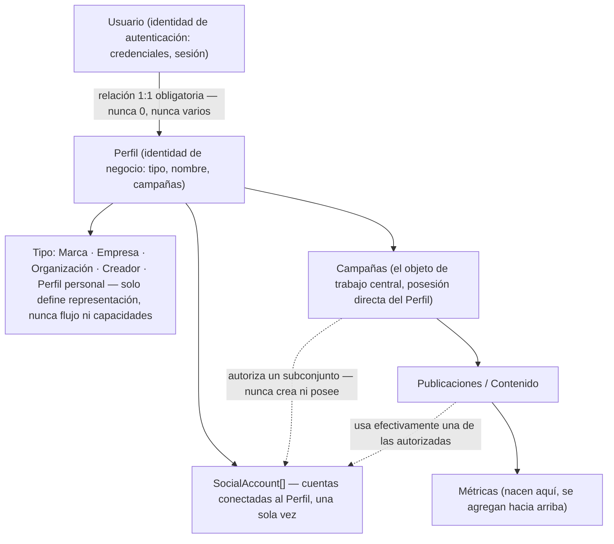
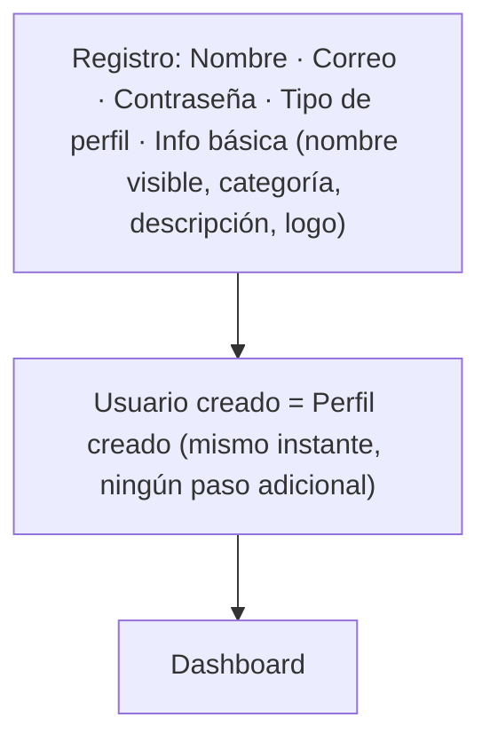
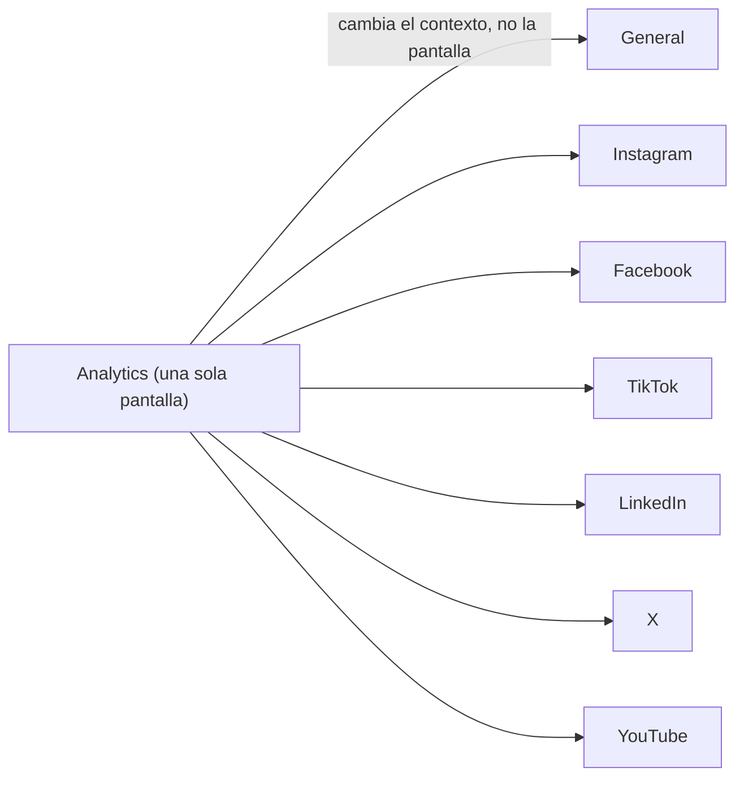
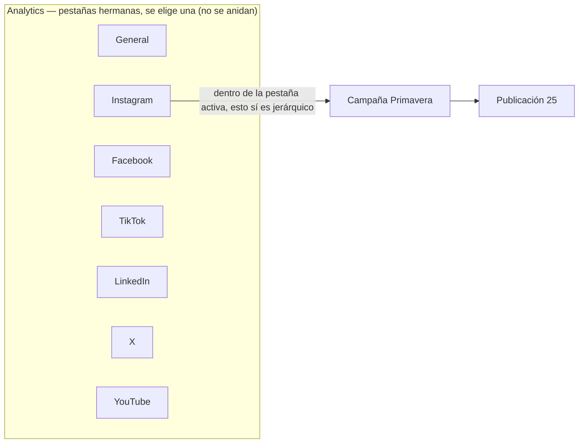

# Análisis de impacto — Rediseño de dominio a Perfil único + Analytics v2

> Documento de análisis previo a implementación. No se modificó ningún archivo de código durante su elaboración. Complementa (no reemplaza) `docs/frontend-functional-documentation.md`, que describe el estado actual del sistema con el modelo "Brand" vigente.

## Historial de correcciones de este documento

- **v1**: describía una *migración* Brand→Profile (renombrar una entidad, conservando su naturaleza de listado administrable). Enfoque descartado.
- **v2**: corrigió a un modelo de "perfil único por usuario", pero todavía trataba al Perfil como una entidad que el usuario *administra* (separada de su identidad), colgaba Redes y Métricas directamente del Perfil, y proponía nombres (`ConnectedAccount`, renombrar `/profile`) que la revisión siguiente rechazó.
- **v3 (esta versión)**: corrige los cinco puntos anteriores. El usuario **es** un perfil (no lo administra como una entidad externa). Las **campañas** son el objeto de trabajo central, no la configuración del perfil. Las redes se seleccionan **por campaña**, no de forma fija a nivel de todo el perfil. Las métricas nacen de las publicaciones y se agregan hacia arriba, nunca al revés. Analytics se modela explícitamente como **una sola pantalla con cambios de contexto**, no como pantallas distintas. Se revierte la propuesta de nombre `ConnectedAccount` (vuelve `SocialAccount`) y se revierte la idea de renombrar `/profile` (no hay colisión: es el mismo concepto para todos los roles, con contenido dependiente del tipo).

---

## Parte A — Modelo de dominio

### A.0 Dos áreas distintas: Identidad y Operación

Antes de entrar en el detalle de cada sección, conviene separar explícitamente dos áreas que el resto del documento ya trata de forma distinta pero que conviven mezcladas en varias secciones si no se nombran aparte:

| Área | Qué contiene | Con qué frecuencia cambia |
|---|---|---|
| **Identidad** | Usuario, Perfil, Tipo, Logo, Descripción | Prácticamente estática una vez creada (§A.3) |
| **Operación** | Campañas, Contenido, Analytics, `SocialAccount`s (Redes) | Cambia constantemente — es donde ocurre el trabajo diario |

La Identidad responde a "quién es este perfil"; la Operación responde a "qué está haciendo este perfil ahora mismo". Esta distinción no introduce ninguna entidad ni pantalla nueva — es la misma separación que ya aparece de forma dispersa en §A.3 (campañas como objeto de trabajo, perfil como dato mayormente estático) y en §A.6 (contenido de `/profile` dependiente del tipo) — nombrarla aquí, al inicio, sirve como mapa de lectura para el resto de la Parte A: las secciones A.1–A.2 tratan de Identidad; A.3–A.5 tratan de Operación; A.6–A.9 tratan de cómo ambas conviven en la misma interfaz sin mezclarse.

### A.1 El usuario ES un perfil (no administra uno)

Corrección central de esta versión: en v2 el diagrama mostraba `Usuario → Perfil → [ramas]`, dando a entender que el Perfil es una entidad separada que el usuario crea/administra (igual que hoy administra "una marca"). Eso seguía siendo el modelo viejo con otro nombre. El modelo correcto es que **registrarse es, en sí mismo, convertirse en un perfil** — no hay un paso posterior de "crear mi perfil", el perfil nace en el mismo instante en que existe el usuario.

Precisión importante sobre el alcance de esta afirmación: conceptualmente **siguen existiendo dos nociones distintas** — Usuario (identidad de autenticación: credenciales, sesión) y Perfil (identidad de negocio: tipo, nombre, campañas). No se fusionan en una única entidad técnica. Lo que se fija es que **la relación entre ambas es siempre 1:1** — cada Usuario tiene exactamente un Perfil, nunca cero ni varios, y el usuario nunca administra un conjunto de perfiles entre los que elige. Es esa relación 1:1 obligatoria (no la desaparición de la distinción conceptual) lo que hace correcto decir, a efectos funcionales, que "el usuario es su perfil".

El diagrama de esta sección también corrige una ambigüedad de relaciones que las versiones anteriores dejaban implícita: **el Perfil posee dos cosas distintas de forma directa** — sus cuentas conectadas (`SocialAccount[]`) y sus campañas — no una encadenada dentro de la otra. Una campaña **nunca crea ni es dueña de una cuenta social**; únicamente selecciona, de las cuentas que el Perfil ya tiene conectadas, cuáles va a usar. La relación entre Campaña y `SocialAccount` es de **referencia/uso**, no de contención — por eso el diagrama las conecta con una flecha punteada, distinta de las flechas sólidas de posesión real (Perfil→Campañas, Campañas→Publicaciones, Publicaciones→Métricas). La red social, en este modelo, es el **contexto** en el que una publicación se difunde (una propiedad de la publicación, resuelta a través de qué `SocialAccount` usó), no un contenedor jerárquico del contenido — ver el detalle completo de esta relación en §A.4.



El diagrama ya no colapsa Usuario y Perfil en un solo nodo — son entidades distintas, tal como aclara el párrafo anterior, unidas por una relación 1:1 obligatoria en vez de fusionadas en una sola identidad técnica.

El `type` del perfil (uno de los 5 valores) **nunca** crea un flujo de registro distinto, una pantalla distinta ni capacidades distintas — solo cambia cómo se etiqueta/representa visualmente ese perfil (ícono, texto "Marca" vs. "Creador de contenido", etc.), exactamente como hoy `BrandType` ya distingue "brand" de "profile" sin ninguna diferencia funcional (documentado en el documento funcional original: *"Marca y Perfil son funcionalmente idénticos. La distinción es visual, no funcional"*).

### A.2 Registro — versión final, sin onboarding



Esto cierra definitivamente el punto que en v2 quedó como pregunta abierta. Confirmado: **no existe onboarding obligatorio**. El registro pide exactamente 5 cosas (nombre, correo, contraseña, tipo de perfil, información básica) y entra directo al Dashboard. Conectar redes sociales, crear la primera campaña y elegir Community Manager **no son parte del registro** — son acciones que el usuario realiza después, desde su propio flujo de trabajo (ver §A.3–A.4), probablemente guiadas por estados vacíos con llamada a la acción (patrón que ya existe hoy: `EmptyState` con acción, usado en `DashboardDisenador` y `/my-campaigns`).

Esto reemplaza por completo al `OnboardingWizard` de 5 pasos actual (`/onboarding`, `brands-front`) — no se comprime, se retira: sus pasos 1–2 (tipo + datos básicos) se absorben dentro del formulario de registro mismo; sus pasos 2–4 (redes, campaña, CM) dejan de ser un wizard secuencial y pasan a ser acciones independientes iniciadas por el usuario cuando las necesita, no un flujo obligatorio antes de poder usar el sistema.

### A.3 Las campañas son el centro del sistema

Corrección explícita al árbol de v2, que colgaba "Campañas" de una rama genérica "Configuración". El árbol correcto es:

```
Perfil (= el usuario)
  ├── SocialAccount[]              ← cuentas conectadas, propiedad directa del Perfil (§A.1, §A.4)
  └── Campañas                     ← objeto de trabajo central, todo gira alrededor de esto
        └── Publicaciones / Contenido
              ├── SocialAccount utilizada   ← la publicación, no la campaña, sabe con cuál cuenta se difundió
              └── Métricas
```

Nótese que "Redes" no aparece como un nivel del árbol entre Campañas y Contenido: la red social es el contexto de difusión de cada publicación (resuelto a través de qué `SocialAccount` conectada se usó), no un contenedor jerárquico intermedio — ver §A.4 para el detalle completo de por qué esa distinción importa.

**Precisión sobre quién sabe qué**: la campaña **autoriza** un subconjunto de `SocialAccount`s (vía `socialAccountIds`, §A.4) — es decir, declara cuáles *pueden* usarse — pero es la publicación individual la que **sabe efectivamente** con cuál de esas cuentas autorizadas se difundió en cada caso concreto. Esto es coherente con §A.5 (las métricas nacen en la publicación, nunca más arriba): igual que una métrica no existe a nivel de campaña sino que se agrega hacia arriba desde la publicación, la cuenta usada tampoco es un dato de la campaña — es un dato de la publicación, que la campaña simplemente acota de antemano. Esta es la misma relación ya representada con flechas punteadas separadas en el diagrama de §A.1 (`Campañas -.-> Cuentas` para la autorización, `Publicaciones -.-> Cuentas` para el uso real) — el árbol de esta sección ahora lo refleja también en su estructura, no solo el diagrama.

Las campañas dejan de ser "una configuración más del perfil" y pasan a ser la razón de ser del sistema — es donde el Cliente, el CM y el Diseñador realmente trabajan día a día (ya documentado así en los flujos de usuario del documento funcional: crear contenido, revisar, aprobar, publicar — todo ocurre *dentro* de una campaña). El Perfil, en cambio, es mayormente estático una vez creado (nombre, tipo, logo, categoría) — quien concentra la actividad recurrente es la campaña.

**Implicación práctica**: la pantalla "Mi Perfil" (§A.6) debe presentar las campañas como su contenido principal — no como un dato secundario (un contador, como hoy `MockBrand.activeCampaigns`) sino como el bloque central de la pantalla (lista/tablero de campañas), consistente con que son el objeto de trabajo real.

### A.4 Las redes se seleccionan por campaña, no de forma fija a nivel de perfil

Corrección importante al modelo técnico. Hoy, una `BrandProfile` (cuenta conectada a una red) se crea **una vez por marca**, durante el onboarding, y **todas** las campañas de esa marca comparten exactamente el mismo conjunto de redes conectadas — no hay forma de que una campaña use solo Instagram+Facebook+TikTok y otra use solo LinkedIn. El modelo nuevo separa dos capas que hoy están fusionadas en una sola. Es importante remarcar, para no repetir la ambigüedad que las versiones anteriores dejaban implícita en sus árboles (§A.1, §A.3): **una campaña jamás crea, posee ni administra una cuenta social — únicamente la referencia**. La relación es siempre "la campaña usa una cuenta que ya existe", nunca "la campaña tiene su propia cuenta".

1. **Capa técnica (a nivel de Perfil)**: las cuentas de redes sociales que el Perfil tiene conectadas — esto sigue siendo responsabilidad exclusiva del Perfil, porque conectar una cuenta (OAuth, autorización) es un acto que ocurre **una sola vez**, no se repite por campaña. Esta es la entidad hoy llamada `BrandProfile` (ver renombre en §A.7). Un `SocialAccount` existe de forma independiente de si alguna campaña lo está usando en este momento — puede haber cuentas conectadas al Perfil que ninguna campaña activa esté utilizando todavía.
2. **Capa funcional (a nivel de Campaña)**: **cuáles** de esas cuentas conectadas usa una campaña en particular — esto es nuevo, no existe hoy en el modelo. `MockCampaign` necesita un campo nuevo que declare el subconjunto de cuentas conectadas que esa campaña utiliza.

**`networks: SocialNetworkCode[]` vs. `socialAccountIds: string[]` — no eran dos nombres para lo mismo, sino dos modelos distintos. Decisión cerrada: `socialAccountIds: string[]`.**

| | `networks: SocialNetworkCode[]` (descartado) | `socialAccountIds: string[]` (elegido) |
|---|---|---|
| Qué declara exactamente | "Esta campaña publica en Instagram y en Facebook" (tipos de red, sin decir cuál cuenta) | "Esta campaña usa *esta* cuenta de Instagram y *esta* cuenta de Facebook" (referencia directa a la entidad `SocialAccount`) |
| Ventaja | Más simple de tipar y de leer; reutiliza directamente el mismo `SocialNetworkCode` que ya usa todo `analytics-front` hoy, sin indirección adicional | Modelo más correcto desde el punto de vista de datos: referencia la entidad real en vez de re-derivarla; queda preparado para el caso en que un Perfil tenga más de una cuenta en la misma red (hoy no puede pasar, porque `BrandProfile` es única por red y por marca — `@@unique([brandId, socialNetworkId])` en el esquema de base de datos ya explorado en este proyecto — pero nada en el modelo de dominio nuevo garantiza que eso siga siendo cierto para siempre) |
| Limitación | Si en el futuro un Perfil pudiera conectar dos cuentas de la misma red (ej. dos cuentas de Instagram distintas), este campo no podría distinguir cuál de las dos usa la campaña | Exige una indirección extra en cada pantalla que solo necesita saber "¿en qué redes publica esta campaña?" — hay que resolver cada id contra su `SocialAccount` para obtener el código de red |
| Coherencia con el resto del modelo actual | Alta — es literalmente el tipo que ya usa `SocialMetricFact.networkCode` en Analytics | Alta también, pero introduce una relación (campaña→cuenta) que hoy no tiene ningún equivalente directo en ningún microfrontend |

**Se adopta `socialAccountIds: string[]`**: un modelo totalmente normalizado — la campaña referencia directamente las entidades `SocialAccount` que usa, en vez de re-derivar un tipo de red que tendría que volver a resolverse contra las cuentas reales. La indirección extra que esto exige (resolver cada id contra su `SocialAccount` para saber en qué red aparece) es una desventaja menor frente a quedar preparado desde el día uno para el caso — hoy no soportado, pero no descartado a futuro — de que un Perfil tenga más de una cuenta en la misma red. Esta decisión no altera **el principio arquitectónico**, que permanece igual sea cual fuera el campo elegido: la campaña nunca posee cuentas sociales; únicamente referencia un subconjunto de las cuentas del Perfil.

Esto también implica un cambio funcional concreto en `CreateCampaignDialog` (`brands-front`): hoy el formulario de creación de campaña **no pregunta qué redes usará** (solo nombre, fechas, estado, CM, diseñadores) — bajo el nuevo modelo debería incluir un selector de redes (multi-select sobre las cuentas ya conectadas al perfil), análogo al que ya existe hoy en `StepNetworks.tsx` del onboarding actual, reutilizable tal cual.

**Decisión cerrada: ¿qué pasa cuando se desconecta una `SocialAccount` que una campaña ya está usando?** Ejemplo: un Perfil tiene Instagram, Facebook y TikTok conectadas; una campaña activa usa Instagram y TikTok (`socialAccountIds`); el usuario desconecta Instagram. Existían tres opciones:

- **Opción A** — la campaña pierde Instagram automáticamente (se elimina de su `socialAccountIds` en cascada).
- **Opción B** — no se puede desconectar la cuenta mientras exista una campaña activa que la esté utilizando.
- **Opción C** — la campaña queda en un estado inválido hasta que alguien la corrija manualmente.

**Se adopta la Opción B**: desconectar una `SocialAccount` referenciada por alguna campaña activa queda bloqueado — la UI debe impedir la acción (ej. deshabilitar el botón de desconexión, o mostrar un error explicando qué campañas la están usando) hasta que el usuario retire esa cuenta de cada campaña activa primero, o esas campañas finalicen. Esta opción se prefiere sobre A porque una eliminación en cascada podría alterar silenciosamente el alcance de una campaña en curso sin que nadie lo decida explícitamente; y sobre C porque evita que el sistema permita, aunque sea temporalmente, un estado inconsistente (una campaña "rota" navegable). Es consistente con el principio ya establecido en esta sección: la campaña nunca posee la cuenta, así que la cuenta no debería poder desconectarse ignorando que sigue siendo referenciada. Esto no afecta la implementación inicial de las Fases A–D (§A.10) — es una regla de validación a nivel de negocio, no un cambio de modelo de datos — pero sí queda documentada aquí porque es la única pieza de comportamiento de dominio que faltaba definir.

### A.5 Las métricas nacen de las publicaciones, nunca al revés

Corrección de encuadre, sin cambio técnico real: v2 todavía presentaba "Métricas" como una rama que cuelga directamente del Perfil. El orden correcto es Perfil → Campaña → Publicación → Métrica, agregando siempre **hacia arriba** (una métrica nace en una publicación concreta; el rendimiento de una campaña es la agregación de las métricas de sus publicaciones; el rendimiento del perfil es la agregación de todas sus campañas).

**Esto ya es exactamente como funciona el modelo de datos de Analytics hoy** — no requiere ningún cambio de lógica: `SocialMetricFact` (Fase 1) ya es un hecho a nivel de publicación individual (`postId`, `campaignId`, `brandId` como referencias, nunca al revés), y **todo** el Analytics Engine (`computeKpis`, `groupByCampaign`, `groupByNetwork`, etc.) ya funciona agregando de abajo hacia arriba, nunca al revés. Este punto confirma que la arquitectura de datos de Analytics ya estaba alineada con el modelo de dominio correcto, aunque el diagrama conceptual del documento (no el código) todavía no lo reflejara con precisión.

**Precisión conceptual sobre `brandId`**: aunque la estructura y la lógica de agregación de `SocialMetricFact` no cambian, sí cambia lo que ese campo representa — antes la métrica pertenecía a una `Brand`, ahora pertenece a un `Profile`. Dejarlo escrito como `brandId` sin esta aclaración sugeriría que `Brand` sigue existiendo como entidad principal del dominio, cuando en realidad es solo el nombre técnico heredado de un campo cuyo significado ya es `profileId` — el rename mecánico (`brandId`→`profileId`) está descrito como Fase E en §A.10, pero el cambio de *significado* ocurre desde ahora, no recién cuando se ejecute esa fase.

### A.6 "Mi Perfil" — la ambigüedad era real, pero el modelo v3 la resuelve

La v2 de este documento identificó una colisión entre la ruta `/profile` existente (editor de categorías/especialidades/disponibilidad de CM/Diseñador) y un nuevo "centro de administración" para el perfil de negocio del Cliente, y proponía renombrar una de las dos. **Esa ambigüedad era legítima en ese momento**: mientras el Perfil se modelaba como una entidad que el usuario *administra* (v2), era razonable pensar que "mi perfil personal de habilidades" (CM/Diseñador) y "mi perfil de negocio administrado" (Cliente) eran dos cosas que un mismo usuario podría necesitar ver por separado, compitiendo por el mismo nombre de pantalla.

Lo que cambia en esta v3 es la premisa de fondo (§A.1): si el usuario **es** un perfil en vez de administrar uno, entonces no hay "mi perfil personal" y "mi perfil de negocio" como dos cosas que el mismo usuario pueda tener simultáneamente — cada usuario tiene exactamente un perfil, y su `type` determina cuál de los dos contenidos corresponde mostrar. La ambigüedad no se ignora, **se disuelve** porque deja de haber un escenario donde ambos significados apliquen a la misma persona a la vez: un Cliente nunca ve el contenido de CM/Diseñador y viceversa, así que no hay verdadera competencia por el nombre, solo un contenido que varía según quién visita la misma ruta. `/profile` ya es, hoy, "Mi Perfil" para un CM o Diseñador (solo que su contenido son categorías/especialidades/bio en vez de campañas/redes/logo). Bajo el tipo correspondiente, la **misma pantalla y la misma ruta** debe mostrar el contenido adecuado al tipo de perfil de quien la visita:

| Tipo de perfil (visitando `/profile`) | Qué contenido muestra hoy / debería mostrar |
|---|---|
| Marca / Empresa / Organización / Creador (Cliente) | Tipo, nombre, logo, descripción, categoría, redes conectadas, **campañas** (bloque central, §A.3), score general |
| Perfil personal de CM/Diseñador | Categorías, especialidades, disponibilidad, bio — **exactamente lo que `/profile` ya muestra hoy**, sin ningún cambio |

Se recomienda mantener `/profile` con su nombre y ruta actuales, generalizando su contenido para que dependa del `type` del perfil de quien la visita, en vez de crear una ruta nueva.

**Regla arquitectónica explícita**: "contenido dependiente del tipo" debe implementarse como **una sola página con secciones internas condicionadas por `type`**, nunca como componentes de página separados por rol. Es decir:

```
ProfilePage
  Header (común a todos los tipos)
  switch (type)
    ClientSection            (Marca / Empresa / Organización / Creador)
    CommunityManagerSection  (Perfil personal de CM)
    DesignerSection          (Perfil personal de Diseñador)
```

`/profile` sigue siendo **una** página (`ProfilePage`); lo que cambia según `type` es cuál de las secciones internas se renderiza, no la página en sí. **No deben existir** `ClientProfilePage`, `DesignerProfilePage`, `CMProfilePage` como componentes de página independientes — crear una página por rol reintroduciría, a nivel de implementación, exactamente la misma fragmentación de dominio que el resto de este documento se esfuerza en eliminar a nivel conceptual (§A.1, §A.6): un perfil dejaría de ser "un perfil con distintos contenidos posibles" para volver a ser, en la práctica, varias entidades de UI distintas disfrazadas de una sola ruta.

**Nota aparte, fuera del alcance de este rediseño**: durante el análisis surgió la idea de una pantalla "Mi Cuenta" — configuración pura de autenticación/sesión (correo, contraseña, preferencias de notificación), distinta de "Mi Perfil" (que es la identidad pública de negocio). Se deja registrada aquí únicamente como **posible mejora futura**, no como parte del impacto de este documento — no forma parte del rediseño solicitado, no tiene fase asignada en §A.10, y no debe interpretarse como algo pendiente de implementar en esta iniciativa.

### A.7 Naming: se revierte `ConnectedAccount`, vuelve `SocialAccount`

Corrección aceptada: `ConnectedAccount` describe un **estado** (conectada o no), no la entidad en sí — y la entidad ya tiene hoy un campo `active: boolean` que puede ser `false` (una cuenta puede existir, y estar desconectada/inactiva, sin dejar de ser la misma entidad). Nombrar el tipo por un estado transitorio es una fuente de confusión futura (¿qué pasa con una `ConnectedAccount` cuando `active === false`? ¿deja de ser una `ConnectedAccount`?).

**Qué representa `SocialAccount`, de forma explícita**: es una cuenta que **existe** en una red social concreta (tiene `handle`, `socialNetwork`, historial de `followers`) — su existencia como entidad es independiente de si en este momento está conectada, activa, o si alguna campaña la está usando. Puede estar `active: true` (conectada y en uso) o `active: false` (desconectada, pausada, o simplemente no utilizada por ninguna campaña vigente) **sin dejar de representar la misma cuenta** — el estado de conexión es un atributo *de* la entidad, no la entidad misma. Es exactamente esta independencia entre "qué es" y "en qué estado está" lo que hace que `SocialAccount` sea el nombre correcto y `ConnectedAccount` no lo sea: un nombre de entidad no debería quedar invalidado ni ambiguo cuando cambia uno de sus atributos.

Entre las alternativas propuestas (`SocialAccount`, `SocialProfile`, `SocialNetworkAccount`):

- **`SocialProfile` se descarta** — reintroduce exactamente la misma colisión léxica con "Perfil" que motivó abandonar `BrandProfile` desde el principio (sería aún más confuso, porque ahora "Perfil" tiene un significado de dominio muy central y específico, §A.1).
- **`SocialAccount`** (recomendado) — neutral respecto al estado de conexión, describe con precisión los campos reales del objeto (`handle`, `followers`, `socialNetwork`, `active`), y no colisiona con ningún otro concepto del sistema.
- **`SocialNetworkAccount`** — misma idea, más explícito/más largo; alternativa válida si se prefiere máxima claridad sobre brevedad.

**Decisión: `SocialAccount`.** Reemplaza tanto la propuesta `SocialAccount` original de la v1 (coincide) como el `ConnectedAccount` de la v2 (se descarta).

### A.8 Inventario técnico (actualizado a v3)

| Concepto | Estado / decisión en v3 |
|---|---|

| `Usuario`/`Perfil` | Entidades técnicamente distintas unidas por relación 1:1 obligatoria (§A.1) — no hay dos rutas de creación separadas ni forma de que una exista sin la otra |
| `BrandType` → `ProfileType` (5 valores) | Sin cambio respecto a versiones anteriores |
| `BrandProfile` → `SocialAccount` | Confirmado (revierte `ConnectedAccount` de v2) |
| `MockCampaign` | **Gana un campo nuevo**: `socialAccountIds: string[]` (subconjunto de `SocialAccount` que esa campaña usa) — decisión cerrada en §A.4; no existía en ninguna versión anterior de este análisis |
| `CreateCampaignDialog` | Gana un paso de selección de redes (nuevo — hoy no lo tiene) |
| Ruta `/brands` (listado) | Se retira (confirmado desde v2) |
| Ruta `/brands/[id]/*` | Se absorbe dentro de `/profile` (generalizado, §A.6) — ya no es una ruta nueva separada (`/my-profile`), es la ruta `/profile` existente con contenido dependiente del tipo |
| `/profile` (CM/Diseñador) | **Se mantiene sin cambios de nombre** — se generaliza su contenido por tipo (§A.6) |
| Pantalla "Mi Cuenta" | **Fuera de alcance** — posible mejora futura, no forma parte del impacto de este rediseño (§A.6) |
| `AnalyticsFiltersState.brandId` → `profileId` | Sin cambio respecto a versiones anteriores. `profileId` **continúa existiendo como identificador técnico** de la entidad Perfil dentro del modelo de datos — el hecho de que el usuario nunca elija entre varios perfiles (relación 1:1, §A.1) no elimina la necesidad del campo, solo elimina la necesidad de una UI para seleccionarlo |
| `AppModule.BRANDS`→`PROFILES`, permiso `brands:manage`→`profiles:manage` | **Se retira** (no se renombra) — no existe catálogo de perfiles administrable bajo el nuevo modelo; ver decisión cerrada en Plan de validación |
| `SocialMetricFact` (Analytics, Fase 1) | **Estructura y lógica de agregación sin cambio** — pero `brandId` pasa conceptualmente a representar el `profileId` del nuevo dominio (ver nota en §A.5); el rename mecánico se ejecuta en la Fase E (§A.10) |

### A.9 Riesgos (actualizado)

1. **Confundir "tipo de perfil" con "flujo distinto"** — el riesgo más importante de implementar mal §A.1: si en algún punto del código se termina condicionando lógica de negocio (no solo presentación) según `type`, se rompe la premisa de que los 5 tipos comparten exactamente las mismas capacidades. Mitigación: `type` solo debe leerse en componentes de presentación (labels, íconos), nunca en el Analytics Engine, en reducers, ni en guards de permisos.
2. **`MockCampaign.socialAccountIds` es un campo genuinamente nuevo** (no un rename) — a diferencia de la mayoría de los cambios de este análisis, este sí agrega información donde no había ninguna. Mitigación: poblarlo de forma consistente con las campañas mock ya existentes (`c1`–`c4`) antes de usarlo en cualquier pantalla, para no dejar campañas con "cero cuentas".
3. **Retirar el `OnboardingWizard`** sin dejar huérfanas sus piezas reutilizables — `StepNetworks.tsx` (selector de redes) sigue siendo necesario, ahora dentro de `CreateCampaignDialog` (§A.4) en vez de dentro del wizard. Mitigación: mover el componente, no borrarlo.
4. Riesgos ya documentados en v2 que siguen vigentes sin cambios: blast radius mecánico de `brandId`→`profileId` en Analytics, `mock-data.ts` no sincronizados entre microfrontends, alcance de backend fuera de esta sesión.
5. **Eliminar `profiles:manage` (antes `brands:manage`) tiene blast radius propio**, distinto de un simple rename — hoy ese permiso gobierna el ítem "Marcas" del Sidebar en varios microfrontends y los mocks de rol en `MOCK_USERS`; retirarlo implica revisar cada Sidebar y cada mock de permisos para no dejar un ítem de menú apuntando a una ruta (`/brands`) que ya no existe. Mitigación: ejecutar esta limpieza en la misma Fase F (§A.10), ampliándola de "rename" a "eliminación".

### A.10 Plan de implementación por fases (v3)

| Fase | Contenido |
|---|---|
| **A** | Rename `BrandProfile`→`SocialAccount`. Ampliar `BrandType`→`ProfileType` (5 valores) |
| **B** | Retirar `/brands` (listado) y el `OnboardingWizard` como flujo obligatorio. Generalizar `/profile` para mostrar contenido según `type` (campañas/redes/logo para Cliente; categorías/especialidades para CM/Diseñador) — sin crear ninguna ruta nueva |
| **C** | Simplificar `/register` a los 5 campos definidos en §A.2, entrando directo a Dashboard |
| **D** | Agregar `socialAccountIds: string[]` a `MockCampaign`; mover el selector de redes de `StepNetworks.tsx` hacia `CreateCampaignDialog` |
| **E** | En `analytics-front`: `filters.brandId`→`profileId`, `setBrand`→`setProfile`, `selectBrandOptions`→`selectProfileOptions` |
| **F** | Resto de microfrontends (`admin-front`, `web-shell`); eliminar el permiso `brands:manage`/`profiles:manage` y limpiar los ítems de Sidebar y mocks de rol que dependían de él (§A.9, §Plan de validación) |
| **G** *(futura)* | Alineación de backend/Prisma, si se decide |

**Justificación del orden**: se verificó explícitamente que las Fases A–D (modelo de dominio y registro) preceden a la Fase E (adaptación de Analytics), y no al revés — esto es intencional, no incidental. La Fase E depende directamente de que la Fase D ya exista: `CampaignBreakdown` filtrando por red dentro de Analytics (§B.2, §B.7) necesita que `MockCampaign.socialAccountIds` ya esté poblado, o no habría ningún dato real que filtrar. Consolidar primero el modelo de dominio y el flujo de registro (A–D) también reduce el riesgo de tener que revisar dos veces el trabajo de Analytics si alguna otra decisión de dominio cambiara durante la implementación (el nombre del campo de §A.4 ya quedó cerrado, pero el principio de secuenciación se mantiene por las mismas razones). La Fase F (resto de microfrontends, permiso `brands`→`profiles`) puede ejecutarse en paralelo a la E si se desea, porque no depende de ella ni Analytics depende de F — se mantiene al final solo por ser la de menor prioridad funcional, no por una dependencia técnica real. El orden actual se conserva sin cambios.

---

## Parte B — Analytics v2: una sola pantalla, cambios de contexto

### B.1 Principio rector: Analytics es una pantalla, no varias

Corrección de encuadre más importante de esta parte: no hay que pensar en "la pestaña Instagram" como una pantalla distinta de "la pestaña General" — **hay una sola pantalla** (`/metrics`), y cambiar de Tab **nunca navega**, solo cambia qué contexto (qué red, qué campaña, qué publicación) está activo en el mismo estado de Redux.



**Esto ya es, casi textualmente, como está construido el código actual** — no es una aspiración, es una confirmación de arquitectura ya correcta: `/metrics` es una única ruta de Next.js; el tab activo es `useState` local en `metrics/page.tsx` (no una ruta, no un cambio de página); y seleccionar una red ya despacha `selectNetwork(code)` sobre `analyticsFilters.slice` en vez de navegar a ningún lado. Lo único que cambia con este pedido es la ubicación *visual* de "red seleccionada" (de tarjetas anidadas dentro de un tab, a tabs de primer nivel), nunca el mecanismo de estado.

### B.2 Estructura estricta — idéntica en las 6 pestañas de red

Se adopta la versión estricta pedida, sin excepciones: **Instagram, Facebook, TikTok, LinkedIn, X y YouTube tienen exactamente las mismas 6 secciones, en el mismo orden**, y la única diferencia entre ellas son los datos (ya resueltos por red gracias a `NETWORK_METRIC_FIELDS`, documentado en el Capítulo 8 §8.4 del documento funcional):

1. KPIs
2. Gráfica principal
3. Métricas (nativas de esa red)
4. Campañas (las campañas que usan esa red — resueltas cruzando `MockCampaign.socialAccountIds` de §A.4 contra el `socialNetwork` de cada `SocialAccount` referenciada)
5. Top publicaciones
6. Insights

Ningún tab de red tiene una sección adicional ni le falta ninguna de estas 6 — se retira cualquier ambigüedad que la v2 había dejado abierta al respecto.

**Las 6 pestañas de red no son una partición exclusiva de las campañas.** Como una campaña puede referenciar varias `SocialAccount` a la vez (§A.4), una misma campaña puede aparecer legítimamente en la sección "Campañas" de más de una pestaña simultáneamente: una campaña que usa una cuenta de Instagram y una de Facebook aparece tanto en la lista de la pestaña Instagram como en la de Facebook, cada vez mostrando únicamente las métricas nativas de esa red. Esto no es una duplicación de datos ni un error de filtrado — es el comportamiento esperado de un modelo donde "pertenecer a una red" se resuelve por membresía de cuenta, no por asignación única. Solo en la pestaña "General" (§B.3) la campaña aparece una única vez, con sus métricas agregadas de todas las redes que usa.

### B.3 "General" — misma base de 6 secciones, más los widgets agregados (nunca sub-tabs)

Se corrige explícitamente lo que la v2 dejaba como pregunta abierta con una sub-navegación posible: **Comparativas, Tendencias, Audiencia y Actividad nunca son tabs ni sub-tabs — son widgets adicionales dentro de la misma pantalla de "General"**, apilados junto a las 6 secciones base.

**Por qué viven únicamente ahí, y no se replican en cada pestaña de red**: los cinco widgets (`NetworkComparison`, `CampaignComparison`, `TrendAnalysis`, `AudienceOverview`, `PostingHeatMap`+`ActivityTimeline`) requieren, por definición, información agregada de **más de una red a la vez** — comparar Instagram contra TikTok, ver la tendencia del Perfil completo, o el mapa de actividad combinando todas las fuentes. Dentro de la pestaña de una sola red (por ejemplo, Instagram), esos mismos widgets perderían sentido funcional: `NetworkComparison` mostrado dentro de "Instagram" estaría comparando Instagram contra sí mismo, y `AudienceOverview`/`PostingHeatMap` acotados a una sola red dejarían de representar la audiencia o la actividad *del Perfil* para representar solo un fragmento, redundante con lo que ya muestran las secciones "KPIs"/"Gráfica principal" de esa misma pestaña. Por eso su lugar natural es exclusivamente "General", que es la única pestaña que opera sobre el conjunto completo de redes al mismo tiempo.

```
General
  1. KPIs
  2. Gráfica principal
  3. Métricas (agregadas de todas las redes)
  4. Campañas
  5. Top publicaciones
  6. Insights
  + Comparativa entre redes         (NetworkComparison, ya existe — Fase 4)
  + Comparativa entre campañas      (CampaignComparison, ya existe — Fase 4)
  + Tendencias                      (TrendAnalysis, ya existe — Fase 4)
  + Actividad                       (PostingHeatMap + ActivityTimeline, ya existen — Fase 4)
  + Audiencia                       (AudienceOverview, ya existe — Fase 4)
```

Esto no obliga al usuario a seguir navegando para ver algo que ya está viendo — todo vive en la misma pantalla, en el mismo scroll. Los 8 componentes construidos en la Fase 4 se conservan **íntegros**, solo cambia dónde se montan (de "tabs propios" a "widgets dentro de General").

### B.4 Breadcrumb — el drill-down nunca cambia de página

El ejemplo de la v3 anterior (`Analytics → General → Instagram → Campaña Primavera → Publicación 25`) encadenaba "General" e "Instagram" como si uno fuera padre del otro, cuando en realidad son pestañas **hermanas** — seleccionar Instagram no implica pasar por General. El diagrama correcto separa explícitamente las dos relaciones que conviven en Analytics: (1) la elección de pestaña, que es una selección entre opciones al mismo nivel, sin jerarquía entre ellas; y (2) el drill-down, que sí es genuinamente jerárquico, pero ocurre **dentro** de la pestaña activa, no entre pestañas.



El breadcrumb visible en pantalla, entonces, no necesita repetir cuál pestaña está activa (eso ya lo indica la barra de Tabs resaltada) — solo representa el drill-down *dentro* de esa pestaña: por ejemplo, estando en la pestaña Instagram, el breadcrumb mostraría `Instagram › Campaña Primavera › Publicación 25`. Cada clic hacia atrás en el breadcrumb **cambia filtros del mismo estado** (`resetToGlobal`, `selectCampaign(null)`, `selectPost(null)` — las mismas acciones ya existentes en `analyticsFilters.slice`), nunca navega a otra URL ni recarga nada. El usuario nunca "se pierde" porque nunca sale de la misma pantalla — el breadcrumb es, en esencia, una vista legible del mismo `drillLevel` que el slice ya deriva automáticamente hoy.

### B.5 Exportación — sin pantalla de configuración, siempre la vista exacta

Regla reforzada, sin ambigüedad: **no existe ni debe crearse ninguna pantalla o diálogo de "configurar exportación"**. El botón de exportar, dentro de cada tab, siempre serializa exactamente lo que esa pantalla está mostrando en el instante del clic — mismos filtros, mismo orden, mismas métricas, mismas visualizaciones. Si el usuario cambia un filtro y vuelve a exportar, el archivo cambia en consecuencia, porque el snapshot siempre se arma a partir del mismo estado que ya está renderizado (`AnalyticsExportSnapshot`/`buildExportSnapshot`, diseño ya definido en versiones anteriores de este documento, sin cambios de forma): nunca hay una segunda fuente de datos ni un paso de configuración intermedio.

### B.6 Qué se reutiliza (confirmado, sin cambios)

Se confirma la constatación de la v2: la arquitectura de Fases 1–4 ya estaba preparada para este modelo sin saberlo. `selectFilteredMetricFacts` ya respeta `selectedNetwork`; todos los selectores derivados (KPIs, series de tiempo, insights, top posts, campañas) ya funcionan correctamente acotados por red. El trabajo de esta parte es de **layout** (reorganizar dónde se montan 20 componentes ya construidos en una jerarquía de 7 Tabs con estructura estricta) y **un campo de dato nuevo** (`MockCampaign.socialAccountIds`, §A.4) — no requiere lógica nueva en el Analytics Engine, salvo la resolución cuenta→red descrita en §B.2 para poblar la sección "Campañas" de cada pestaña.

### B.7 Riesgos (actualizado)

- Filtrar `CampaignBreakdown` por red (sección 4 de §B.2) depende de que exista `MockCampaign.socialAccountIds` (§A.4) ya poblado — si ese campo no se puebla antes de tocar Analytics, las campañas seguirán apareciendo en todas las redes por igual, sin distinción real.
- La resolución cuenta→red (§B.2) para decidir en qué pestañas aparece cada campaña debe implementarse una sola vez, en un selector reutilizable — no recalcularse de forma distinta en cada pestaña, para no arriesgar que una campaña aparezca en unas redes y no en otras por una inconsistencia de cálculo en vez de por sus `socialAccountIds` reales.
- 7 Tabs de primer nivel + una cantidad considerable de widgets apilados dentro de "General" (§B.3) exige cuidado de rendimiento de scroll/carga — recomendable revisar si algunos widgets de "General" deben cargar de forma perezosa.
- Mismo riesgo de UI para 7 tabs simultáneas ya señalado en versiones anteriores (`variant="scrollable"` en el `Tabs` de MUI).

---

## Plan de validación

Puntos que quedaron cerrados en esta v3 (ya no requieren tu confirmación, a menos que quieras corregir algo de la lectura):
- Registro sin onboarding, 5 campos, directo a Dashboard.
- `/profile` se mantiene, se generaliza por tipo — no se crea ruta nueva ni se renombra nada.
- Nombre `SocialAccount` (no `ConnectedAccount`).
- Comparativas/Tendencias/Audiencia/Actividad son widgets dentro de "General", nunca tabs.
- "Mi Cuenta" queda fuera del alcance de este rediseño — registrada solo como posible mejora futura (§A.6), no como pendiente de implementación.
- Usuario y Perfil son entidades distintas unidas por una relación 1:1 obligatoria, no una única entidad fusionada (§A.1, §A.8).
- Campo nuevo en `MockCampaign`: `socialAccountIds: string[]` (§A.4) — se descarta `networks: SocialNetworkCode[]`. El principio arquitectónico no cambia: la campaña nunca posee cuentas sociales, únicamente referencia un subconjunto de las cuentas del Perfil.
- Las pestañas de red en Analytics no son una partición exclusiva de campañas — una misma campaña puede aparecer en varias pestañas si usa varias `SocialAccount` (§B.2).
- **El permiso `profiles:manage` se retira (no se renombra desde `brands:manage`)**: bajo el nuevo modelo no existe un catálogo de perfiles administrable — cada usuario tiene exactamente un perfil (§A.1), creado automáticamente en el registro (§A.2), y entrar a `/profile` (§A.6) depende únicamente de estar autenticado, no de ningún permiso de tipo "manage". La autorización relevante bajo el nuevo dominio se apoya enteramente en los permisos de campaña ya existentes, sin que este rediseño exija tocarlos:

| Permiso | Acción |
|---|---|
| `profiles:manage` (antes `brands:manage`) | **Eliminar** |
| `campaigns:create` | Mantener sin cambios |
| `campaigns:manage` | Mantener sin cambios |
| `campaigns:view-own` | Mantener sin cambios |

Esta eliminación toca directamente la matriz de permisos (`role_permissions` en BD, según `CLAUDE.md`) y queda formalmente fuera del alcance de un análisis frontend-only — se documenta aquí como la recomendación de diseño, pero su ejecución real corresponde a la Fase F (§A.10) o a una fase de backend equivalente.
- **Prioridad de fases confirmada — no en paralelo**: el orden de ejecución es (1) Modelo de dominio, Fases A–D — consolidar `Profile`, `SocialAccount`, el nuevo registro, la eliminación de `/brands` y `socialAccountIds`, ya que todo lo demás depende de que este modelo exista; (2) Analytics, Fase E — una vez estable el dominio, adaptar filtros, selectores y componentes al nuevo significado de `profileId`, evitando construir lógica sobre un modelo que aún podría cambiar; (3) Limpieza del resto de microfrontends, Fase F — eliminar permisos, rutas, ítems de menú y mocks relacionados con `brands`; esta fase sí puede ejecutarse **en paralelo con la Fase E** (no con A–D) si el equipo está dividido, porque no existe una dependencia técnica fuerte entre limpieza de navegación/permisos y adaptación de Analytics. Este orden reduce retrabajo: primero cambia el significado del dominio, luego se adaptan las vistas analíticas que lo consumen, y finalmente se elimina el legado de navegación y permisos.
- **Regla arquitectónica de `/profile`**: una sola página (`ProfilePage`) con secciones internas por `type` (`ClientSection`/`CommunityManagerSection`/`DesignerSection`), nunca páginas separadas por rol (§A.6).
- **Modelo de publicación-cuenta precisado**: la campaña autoriza un subconjunto de `SocialAccount`s; es la publicación individual la que sabe con cuál de ellas se difundió realmente (§A.3).
- **Desconexión de una `SocialAccount` en uso — Opción B adoptada**: no se puede desconectar una cuenta mientras exista una campaña activa que la esté utilizando; la UI debe bloquear la acción hasta que el usuario la retire de esas campañas primero (§A.4).

---

## Conclusión arquitectónica

Este rediseño cambia el centro de gravedad conceptual del dominio, pero no la arquitectura técnica del sistema. El dominio deja de estar organizado alrededor de "la Marca" como entidad que un usuario administra desde afuera, y pasa a organizarse alrededor del Perfil como la identidad misma del usuario dentro de la plataforma. Desde la perspectiva funcional del usuario, el perfil se crea automáticamente junto con la cuenta y no existe un flujo separado para crear o elegir perfiles. El tipo de perfil (Marca, Empresa, Organización, Creador o Perfil personal) es solo la manera en que esa identidad se presenta, nunca una bifurcación de flujo o de capacidades.

Dentro de ese modelo, las campañas —no el perfil— son el objeto de trabajo real y recurrente: es donde Cliente, Community Manager y Diseñador efectivamente colaboran día a día, mientras que el perfil en sí es mayormente estático una vez creado. Esta redistribución de importancia también resuelve, casi como efecto colateral, la pregunta de qué redes sociales usa cada pieza de contenido: en vez de una lista fija de redes conectadas al perfil que todas las campañas comparten por igual, cada campaña selecciona su propio subconjunto de las cuentas ya conectadas — un modelo más flexible y más cercano a cómo las marcas reales operan en la práctica.

Analytics, en cambio, no cambia de arquitectura en absoluto — cambia de **organización visual**. El motor de agregación, el slice de Redux, los selectores memoizados y prácticamente los veinte componentes construidos a lo largo de las Fases 1–4 se conservan íntegros; lo único que se reubica es *dónde* se montan (de tarjetas anidadas dentro de un tab a pestañas de primer nivel con estructura idéntica entre sí) y se agrega una sola pieza de dato nueva (`MockCampaign.socialAccountIds`) para que ese filtrado por red tenga sentido también a nivel de campaña.

En conjunto, esto confirma algo importante para dimensionar el esfuerzo de implementación: la mayor parte del trabajo de este rediseño es de **reorganización del dominio y reutilización deliberada de lo ya construido** —renombrar entidades, retirar una pantalla de listado que deja de tener sentido, generalizar una ruta existente para que sirva a dos audiencias distintas, mover un puñado de componentes de lugar— y no de reconstrucción del sistema. Ninguna funcionalidad ya construida se pierde; se reordena alrededor de un modelo de dominio más fiel a lo que Bananagram siempre quiso ser: un gestor de redes sociales y puntuación digital para cualquier tipo de perfil, no un gestor de marcas con un nombre genérico.

El principal impacto de este rediseño no está en la tecnología utilizada ni en los componentes ya construidos, sino en la forma de interpretar el dominio. La mayoría de las estructuras existentes pueden reutilizarse; lo que cambia es el significado de las entidades y la manera en que se relacionan entre sí. Por ello, el esfuerzo principal consiste en reorganizar el modelo de negocio y adaptar la navegación y los flujos de usuario, más que en desarrollar nueva infraestructura técnica.

*Documento generado por análisis estático de código. No fue modificado ningún archivo del proyecto durante su elaboración.*
